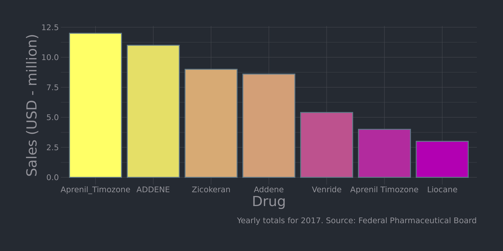
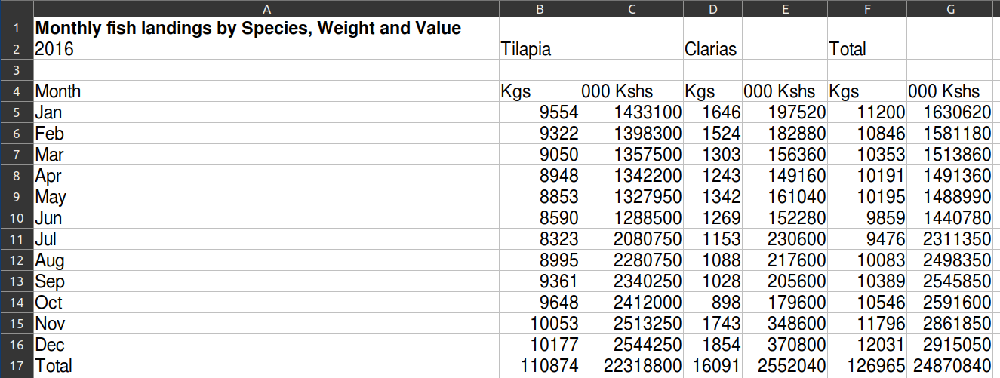
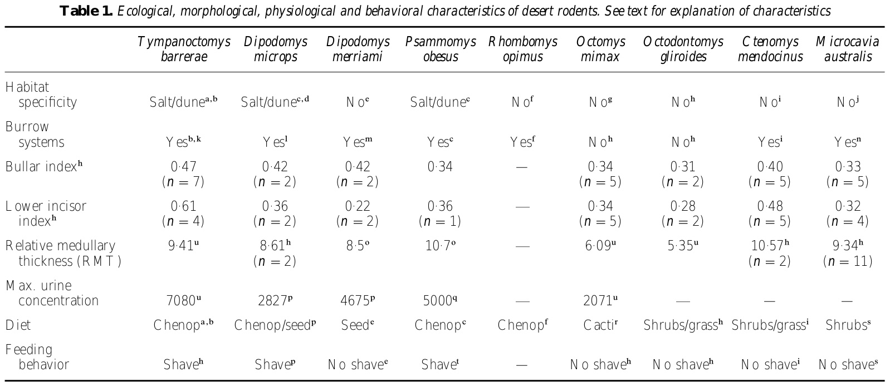
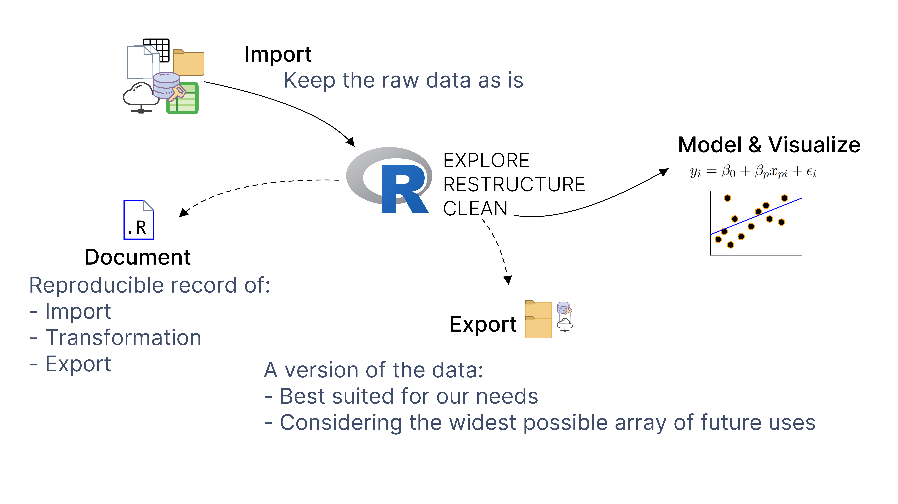

```{r child = "setup.Rmd"}
```

```{r html output, eval=TRUE, include=FALSE}
options(htmltools.dir.version = FALSE, htmltools.preserve.raw = FALSE)
```

```{r imgs setup, echo=FALSE, eval=TRUE}
knitr::opts_chunk$set(fig.retina = 3, warning = FALSE, message = FALSE)

```

```{r xaringan-tachyons, echo=FALSE, eval=TRUE}
xaringanExtra::use_tachyons()
```

```{r xaringan-extra-styles, eval=TRUE, echo=FALSE}
xaringanExtra::use_extra_styles(
  hover_code_line = TRUE,     
)
```

```{r load pkgs, echo=FALSE, eval=TRUE}
library(dplyr)
library(gt)
```

class: center, middle, dk-section-title
background-image:url("images/gawn-australia-_OUvt8kLf0s-unsplash.jpg")
background-size: cover
# What is Data Cleaning?

???
Hello and welcome to the Data Cleaning in R course.
Before we begin, let's define Data Cleaning. The following are some common definitions that I found online and paraphrased.
---

class: center, middle

>.large["Mechanistic, time consuming process of identifying and fixing incomplete, inaccurate, irrelevant, or duplicated data"]

???
A popular definition describes data cleaning as a:
--

>.large["Tedious tasks that get in the way of extracting true value and insights from data"]

???
Others mention a series of
--

> .large["Not difficult, not _real_ work. Done (grudgingly) before the main analyses"]

???
and some say it is:
---

class: center, middle

>.large["~~.gray[Mechanistic, time consuming]~~ process of identifying and _fixing_ incomplete, inaccurate, irrelevant, or duplicated data"]

>.large["~~.gray[Tedious tasks that get in the way of]~~ extracting true value and insights from data"]

> .large["~~.gray[Not difficult, not _real_ work. Done (grudgingly) before the main analyses"]~~]

???
I'd like to refute most of that. Data cleaning indeed involves fixing issues with our data to make it more usable and helpful, it is real work, and it is not a trivial process.
---

## Data cleaning:

.large[
A spectrum of **reusable data transformations**  to make data **usable** and to obtain more meaningful results from our analysis or visualization methods.] 

???

Let's try again. We can define data cleaning as a spectrum of data transformation steps to make data usable and to obtain more meaningful results from our analysis or visualization methods.

--

.large[
Has no single end product, because different systems and methods consume different input data formats and structures.] 

???

There is no one particular end product when we're cleaning data, because different programs take different inputs and we need to adjust our approach for each one. Still, clean data has certain things in common that we will be discussing throughout this course.  

---

## Cleaning data involves:

???
When we need to clean some data, these are the three main steps in the process.

--

.large[
**1\.** Identifying specific **issues** that hinder an analysis, visualization, or reporting workflow.]  

--

.large[
**2\.** Determining which approach or tool is needed to address each issue.] 

--
.large[
**3\.** Transforming the data, making them more appropriate and valuable for a variety of downstream purposes.
]

---

## Common Issues

.fl.w-50[

- Non-rectangular data  
- Unusable variable names
- Whitespace 
- Inconsistent letter case  
- Missing/implicit/misplaced grouping variables
]

.fl.w-50[
- Compound values  
- Duplicated values  
- Broken values  
- Empty rows and columns  
- Numbers stored as text  
]

???
Most of the existing definitions of data cleaning mention fixing issues with the data, but these issues are often mentioned without descriptions. I have tried to collect and describe the most common issues here.
Data in the real world can have none, or many of these issues that make it less usable. These are listed here for reference, and we will deal with all of them in another section of this course.
---

## Why data cleaning

???
We often need to clean our data simply to get our software to read the data and behave as we expect it to.

--
.large[
- Enables downstream tasks by making data readable & usable  
]
--
.large[
- Saves time (rows and columns in a data object ready for use)  
]
???
having clean data saves time, for example. by having rows and colums on which we can immediately perform operations.
--
.large[
- Avoid potentially costly delays, or misinterpretations
]

???
After that, clean data is important to avoid delays, biases, or misinterpretations.

---

## Why data cleaning in R

???
Why should we use R for data cleaning.

Because, by working with code and not interactively with pointing and clicking, we leave a record of our actions and can run it again whenever we want.
--
.large[
- Document and reproduce the process  
]
--
.large[
- Less time editing manually  
]
???
with R, we can work on large files or with many files at once, which saves us time and might not even be feasible if done by hand.
--
.large[
- Purpose-built tools available and well documented
]
???
One of the main reasons for I like R so much for data cleaning is because there are a number of tools and packages built specifically for cleaning data, which have good documentation and a large community of helpful users.
--
.large[
- Code can be reproduced and repurposed
] 
???
Finally, the code we write can be run many times and repurposed for new projects.
---
class: center, middle

# Examples

???
Now, let me show you some examples of what can happen when we don't clean our data.
---
class: middle, center

```{r, eval=TRUE, out.width = "96%", echo=FALSE}

```

???
This graph is entirely fictional, but it is based on a real one I saw on an internal dashboard used by a pharmaceutical company. This chart shows drug sales in a year, taller bars mean more sales and the bars are ordered in decreasing value. If an executive is simply interested in knowing which was the top selling drug that year, this plot can be misleading. 

Why is that?

Well, there are minor variations in how the drug names were stored in the original data, and this issue made it onto a final product. Look at the labels. There are two drugs with duplicate entries because the plotting software does not realize that a name with underscores between names should be the same as a name with spaces. Same with two drugs that vary in letter case, one is in all upper case.

In this situation, the top-selling drug is not the one the chart is showing, so this is misleading. This looks obvious, but these kinds of issues are common and they can go unnoticed if we are working, for example with many years worth of data for hundreds of drugs.

---
```{r, eval=TRUE, echo=FALSE}
isi <- 
tibble::tribble(
         ~Researcher, ~Publications,
      "James Wilson",      "19 $$$",
      "Colt Whitman",         "18*",
        "Jane Allen",         "17*",
        "Maria Dias",          "14",
   "Dr. Deavan Smith",           "9",
     "Angie Ramirez",           "7",
        "Ellen Dice",           "5",
    "Dr. Jane Allen",           "4",
  )

isi %>% gt %>%   tab_header(
  title = md("Faculty Productivity Bonuses"),
  subtitle = "2020 - School of Engineering"
)  %>% tab_footnote(locations = cells_column_labels(columns = "Publications"),
  footnote = md("**$$$**  Award winner, **\\***  Honorable mention")
) %>% 
  tab_options(table.font.size = px(28))
```

???
This other example is also fictional, but it is based on a report used at a university to award the most productive faculty member each year with a cash bonus. This is a simplified made up version, but it is another good example of the consequences of not cleaning data before making calculations.

Here, the same faculty members appears twice in the data, because for whatever reason some entries include  titles while the rest of the entries do not. This is also a simple fix, which could have avoided the administrative hassle and embarrassment of amending the award after it had already been paid to the wrong person. 

---

class: middle, center

```{r, eval=TRUE, out.width = "100%", echo=FALSE}

```

.small[Source: [Kenya Ministry of Agriculture, Livestock and Fisheries](https://africaopendata.org/organization/kenya-ministry-of-agriculture-livestock-and-fisheries)]

??? 
This next example is real data, describing fisheries data for a lake in Kenya in 2016. There are no mistakes in the values, but the data are structured in a way that makes sense to humans but is harder to feed into any analysis. 

If we had to restructure multiple files with this complicated structure, say, for many lakes and many years, the process can become time consuming. Fortunately, we can do this more efficiently in R, and will do so in a later lesson.

---

</br>
.left[
```{r, eval=TRUE, out.width = "100%", echo=FALSE}

```
]

.small[Source: Ojeda _et al._ [(1999)](https://doi.org/10.1006/jare.1999.0496)]

???
This next example is a table from a scientific publication. A lot of information is being presented here and if we were to try and import the contents of this table into our analysis software, we would most likely run into some trouble. 

Again, nothing is inherently wrong with this table, but sometimes we might be forced to import and work with these kinds of data sources
---

```{r, eval=TRUE, echo=FALSE}
set.seed(20)
gtcars %>%
  dplyr::select(1:3,bdy_style,hp,trq,ctry_origin) %>% 
  dplyr::filter(ctry_origin == "Italy" | ctry_origin == "Germany") %>% 
  dplyr::group_by(ctry_origin) %>%
  dplyr::sample_n(4) %>%
  dplyr::ungroup() %>%
  dplyr::group_by(ctry_origin) %>%
  gt() %>%   tab_style(
    cell_text(size = '18px'),
    locations = list(cells_body(),
                     cells_column_labels(everything()),
                     cells_title()))
```

.small[source: `gt:gtcars` Luxury Automobiles Dataset]

???

This last example describes some fancy cars. Things are OK for the most part, but notice these rows that group the cars by their country of their manufacturer. This is informative and readable, but not ideal from an analysis perspective, and we will see why later on in the course.


These were just some examples, but hopefully you were able to recognize some of the more common issue in the data and relate them to things you may have seen in your own work.

---
class: inverse

## Your turn

1. Read this short blog [post](https://www.johndcook.com/blog/2021/01/12/data-pathology/) by John D. Cook.
.center[https://www.johndcook.com/blog/2021/01/12/data-pathology/]

2. Reflect on the amount (if any) of data cleaning you perform for your day-to-day work.

---

class: center, middle, dk-section-title
background-image:url("images/willian-justen-de-vasconcellos-JJEQ1SQhkEg-unsplash.jpg")
background-size: cover
# Data Cleaning is Analysis

---

### When we clean data, we make judgements and interpretations

- Are the data in a usable structure?

--

- What constitutes 'unwanted' variation?

--

- Is there any implicit information that needs to made explicit?

--

- What to do about missing data. 

---

class: inverse
## Your Turn

*quiz image goes here

---
class: center, middle

.large[After identifying issues in our data, we decide which tool is best suited to address them.]

--

## This is also data analysis.

--

>.large[Data cleaning is an important stage in most data analyses, not a single-use task of lesser importance.]

---

class: center, middle, dk-section-title
background-image:url("images/endri-killo-tvWqbeOaJnw-unsplash.jpg")
background-size: cover
# The Data Cleaning Process

---

class: middle, center

```{r, eval=TRUE, out.width = "110%", echo=FALSE}

```

---
class: center, middle, dk-section-title
background-image:url("images/bence-boros-l3_9j916sh0-unsplash.jpg")
background-size: cover
# Course Logistics

---

## Requirements and Prerequisites
### You: 

- are familiar with basic data types and objects in R  

- can use functions and arguments  

- have R and RStudio running  

- can install and load packages


---

## Course conventions

- All packages available on **CRAN** (can be installed with .orange[`install.packages()`])   

--

- All slides are available in html format

--

- Package names in .b.rrured[red], preceded by 📦  

--

- Functions and operators in .b.orange[orange]  

--

- Relevant example data is provided in slides (see '**data-setup**' panels)  


---

# My setup

- R v4.0.3  

- RStudio v1.4.1103  

- Default theme and pane layout  

- Linux Mint 20.1

---

## Course setup


**1\.** Create a new RStudio project on your computer


**2\.** Download course materials (data needed for "your turn" exercises) with 
📦 .b.rrured[`usethis`]


```{r, eval=FALSE}
install.packages("usethis") # Install first if necessary
usethis::use_course("FINALURLHERE") # Download course materials 
```

**3\.** Copy the downloaded materials to the folder containing the RStudio project you created for this course. 


