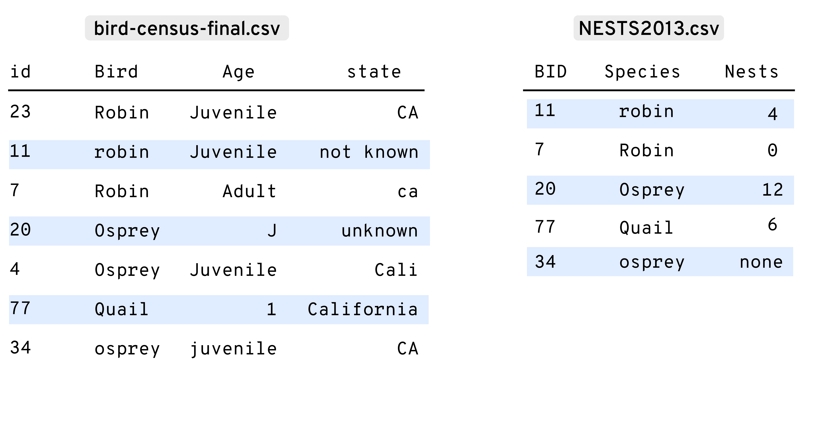
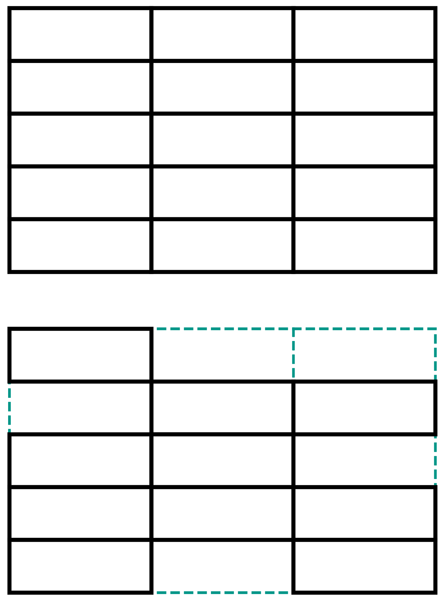
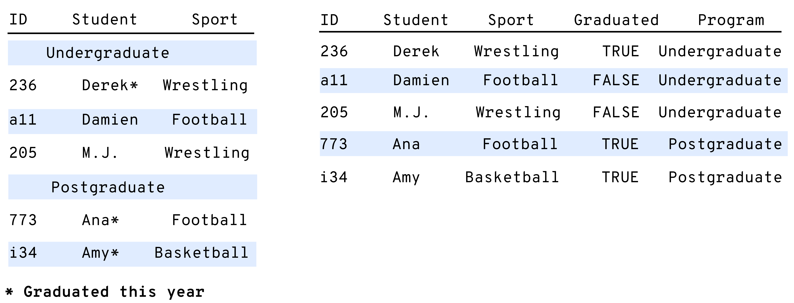
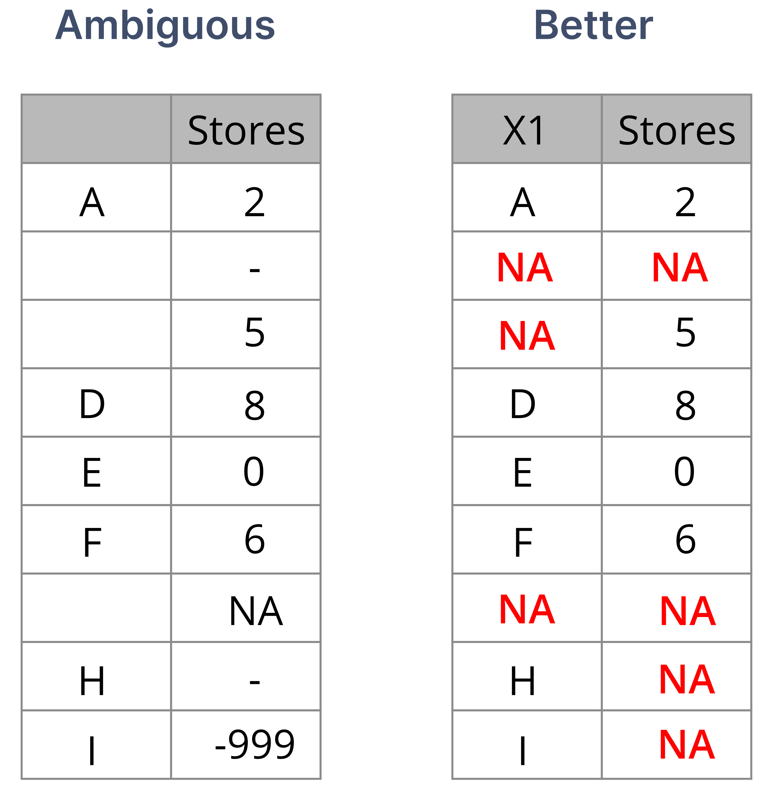

```{r child = "setup.Rmd"}
```

```{r html output, eval=TRUE, include=FALSE}
options(htmltools.dir.version = FALSE, htmltools.preserve.raw = FALSE)
```

```{r imgs setup, echo=FALSE, eval=TRUE}
knitr::opts_chunk$set(fig.retina = 3, warning = FALSE, message = FALSE)

```

```{r xaringan-animate-all, echo=FALSE, eval=TRUE}
xaringanExtra::use_animate_all("fade")
```

```{r xaringan-tachyons, echo=FALSE, eval=TRUE}
xaringanExtra::use_tachyons()
```

```{r, echo=FALSE, eval=TRUE}
library(dplyr)
library(gt)
```

class: center, middle, dk-section-title
background-image:url("images/road-trip-with-raj-ywJx2-ZD8UU-unsplash.jpg")
background-size: cover
# Data Organization Best Practices

???

Because this is a course for cleaning data with R, first we need to go over some good practices for data organization. 

There two reasons for this. 

First, because having well-organized data means less time spent cleaning them later on. This mostly applies at the data collection stage.

Second, because it is a good idea to have a basic template when we are transforming data into more usable forms. This way we don’t have to start from scratch constantly, and our clean data will be more likely to just work in future applications.
---


## Well-organized data

???

Lets go over the more important properties of Well organized data

--

Easier to import and manipulate, less prone to errors.

???
In general, well-organized data makes for smoother workflows.

--


Manual input and interactive restructuring can lead to non-replicable, inadvertent user errors such as omitted, altered, or duplicated data.

???

This also reduces the risk of small errors that can happen if we input or edit data manually.

--

Understanding data organization principles helps us when we produce data,
but also to identify and solve problems in existing data.

???

Following good practices in data organization helps us when we are planning our data collection strategies, but also, being aware of what makes data well-organized can help us identify and solve problems in existing data.

---

## Best Practices in Data Organization

???

We can summarize data organization best practices in three broad items.

--

.large[
- Consistency in names, layouts, abbreviations, units, etc.
]

???

First, be consistent

--

.large[
- Good names for objects, files, and variables
]

???

Second, use good names

--

.large[
- Rectangular data
]

???

Third, try to work with rectangular data whenever possible. I’ll explain what this means later on.

---

## Consistency

```{r birdnests, echo=FALSE, eval=TRUE}

```

???

Lets start with consistency
We should always aim for consistency in names, layouts, abbreviations, and units.

I’ll illustrate this with these two tables from two separate files, but which contain related information on some bird nest census data.

The names of the variables we see on the top row of these two tables have inconsistent capitalization. To make matters worse, when the same variable appears in both tables they appear with different names, for example, ID and BID.

We can also find inconsistency in values within the same column. Look at the State column, where a single value (California) appears in four different forms.  

These two tables have at least three more glaring inconsistencies, can you spot them?


---

## Good Names

???

Now onto using good names. Why good names?

--

.b[
For files, objects in our R environment, and variables in a table:
]

???

Because some of the most important elements in our workflows have names, and we typically refer to them by name.

For good names, we can follow these three suggestions:

--

- Keep names short but informative  

???

1. short, informative names

--

- Avoid spaces and special characters 

???

2. avoid spaces or special characters, this helps us avoid syntax errors.

--

- Avoid using names for versioning (`var_V2_final_2020`)

???


3. also, avoid versioning in names. We’ve all done this, but it can be confusing and counterproductive.

Let’s look at some examples of this advice in action

---

###Short but informative
.fl.w-40[
**Good name**  
`max_prec`
]

.fl.w-60[
**Avoid**  
`Maximum_Precipitation_mm_2010-2014`  
`max`  
`prec`
</br>
]

???

First, short but informative names.
This example is for a variable or file that contains maximum precipitation values.
Max underscore prec seems like a good compromise, because the abbreviations are not too ambiguous and we are not losing information about what’s in the data.
Also note the underscore instead of a space.

---

### Spaces and special characters  

.fl.w-40[
**Good name**  
`mean_price_usd`  
`monthly_temp`
]

.fl.w-60[
**Avoid**  
`Mean Price ($)`  
`Temperature/Month (°F)`
]

???

Now, avoiding spaces and special characters.
We do this partly for style and consistency, but also to avoid syntax errors. We want to avoid surprises if spaces or special characters get replaced somewhat unpredictably when we create new objects or import files. 


---

## Data rectangles
.fl.w-30[
```{r, echo=FALSE, eval=TRUE, out.width="76%"}

```
]

???

Finally, try to work with rectangular data. We often do anyway, but let me define what this means.

Rectangular data means objects with rows and columns, in which:

--

Each row has the same number of columns  

???

each row has the same number of columns, and

--

Each column has the same number of rows  

???

each column has the same number of rows

--

_Vectors and factors of the same length = all columns must have the same 'height'_

???

In R, tabular objects are made up of vector and factors, and if these have the same length, all the columns will have the same height and we will form a rectangle. The example on the top shows three columns with five rows each. 

--

Equal-height columns give a rectangular shape to the data frame

???

If you are more familiar with spreadsheets, think of rectangular data as a range of cells within a sheet. When we define these ranges, the selection of cells is rectangular.
Like in the example at the bottom, data can be rectangular even when we have NA or empty values in the vectors or factors that make up the columns. 

---

## Organizing data in rectangular tables

```{r, echo=FALSE, eval=TRUE, fig.align='center',out.width="80%"}
knitr::include_graphics("images/transposed.png", error = FALSE)
```

???

These small tables are both rectangular, they show the same data in different layouts, but each one has rows and columns and all columns are of the same length.

---

class: center, middle, dk-section-title
background-image:url("images/max-bohme--bz-MQOrd18-unsplash.jpg")
background-size: cover
# Tidy Data and Data Rectangling

???

At this point, we’ve been discussing data organization in very broad terms. Now, let’s move on to actually giving the data inside our objects a usable, standardized structure.

---

.pull-left[## Data imported to R ✅]    

```{r, echo=FALSE, eval=TRUE, fig.align='center',out.width="70%"}
knitr::include_graphics("images/import.png", error=FALSE)
```

???

Once we read our files into R, we can usually tell right away if these are ready for immediate use

---

## Ready for immediate use?

???

When data are ready for immediate use, we can go ahead and start our workflows.

--

.large[
- Subset, group, transform, sort, visualize, model, share
]

--

## Not ready?

???

If this is not the case, we may need to clean and restructure first, but, is there any preferred structure we can use?

--

.large[
- Restructure for easier and more effective handling
]

???

Yes there is. We will follow tidy data principles throughout this course.

---

## Tidy data 

???

Tidy data was proposed by Hadley Wickham as a consistent way to structure datasets, making data transformation and visualization more straight forward. Tidy data is an accessible reformulation of existing principles and definitions from statistics and computer science, to ultimately help us structure our data for maximum usability. 

Data are tidy when:
--

.center.large[
Data arranged in a 2D data matrix   
]

???

they are arranged in a two dimensional matrix with rows and columns, 

--

.center.large[
Rows correspond to observations   
]

???

in which rows correspond to observations 

--

.center.large[
Columns correspond to variables
]

???
and columns correspond to variables.

--

.center.large[
One value per cell
]

???

this leaves us one value per cell.

---

```{r, echo=FALSE, eval=TRUE, fig.align='center',out.width="85%"}
knitr::include_graphics("images/varscols.png", error=FALSE)
```

???

Lets define variables and observations, and see what this looks like

Variables are all values that measure the same attribute across many subjects

observations are all the values measured across different attributes on the same subject 

In this example, we are measuring three different attributes and each observation collects all values across the attributes. This leaves us with values that belong to one variable and one observation. The advantages of tidy data will become more evident as we go on.

---


```{r, echo=FALSE, eval=TRUE,out.width="80%", fig.align='center'}
knitr::include_graphics("images/tidydata.png", error=FALSE)
```

???

Let’s look at another example.
These two tables show the same data, but one is tidy and one isn’t. You might have seen these layouts under the names of long data and wide data.

On the top, a single column has measurements for different attributes, so this is not tidy. In the table on the bottom the columns correspond to variables and the rows to observations. 

---

## Why tidy?

???

Having defined tidy data, we should looks at the main advantages of structuring our data this way:

--

.fl.w-40[
.large[
Easy to reshape into other structures after cleaning or transforming.
]]    

```{r, echo=FALSE, eval=TRUE,out.width="50%"}
knitr::include_graphics("images/pivotingintro.gif", error=FALSE)
```

???

First, tidy data keeps variables organized, and is easy to restructure without losing sense of what is being stored in a table. Look at his animation. The same data can be reshaped smoothly between a long, tidy structure and a wider, more concise structure.

---

## Why tidy?

???

Also, by having observations in rows we are ready to perform operations on each one.

--

.large[
In row-wise operations, each value in an observation will be paired with other values that appear in the same row.
]

```{r, echo=FALSE, eval=TRUE,out.width="60%", fig.align='center'}
knitr::include_graphics("images/discounts.png", error=FALSE)
```

???
 This example shows two ways of structuring some simple data on clothing items, their retail price, and some applicable discounts. In the tidy data on the left, we can immediately calculate the final price for each item with a basic formula because each variable is in a column and each observation is in a row. 

It is more complicated to do the same calculation with the data presented on the right, because the values of price and discount are intermingled in the same column.

---

## Why tidy?

???

This next advantage of tidy data is possibly the most important one from a practical standpoint. 

--

.fl.w-40[
```{r, echo=FALSE, eval=TRUE,out.width="85%", fig.align='left'}
knitr::include_graphics("images/tidyvarsmap.png", error=FALSE)
```
]


.fl.w-60[
.large[
Variables feed directly into model specifications and plotting parameters.
]]

???

With tidy data, variables can be passed directly to models or as elements of a plot. With the tiny table here, we can tell most functions that we want to draw the values of X vs Y as points in a scatterplot, and that we want the points for each observation to be colored according to the variable color.

---

## Why not

???

Having said all that, there is no mandate to always follow tidy data principles. 

--

.large[Tidy data is more repetitive, and often takes up more space than other more condensed representations.]

???

Sometimes this structure can be more repetitive and take up more space on a page. 

--

.large[Not ideal for data entry, or for tables that will be embedded in a text document]

???

For tasks such as data entry or reporting, we can use other more convenient structures.

 Still, being aware of tidy data principles can really help us understand what, if anything, is wrong with the structure of a given dataset and what we can do about it.

To complement the general principles we’ve seen so far, next, we will go over three more specific pieces of advise that will help us organize our data better.

---

class: center, middle, dk-section-title
background-image:url("images/jahongir-ismoilov-RcjvFd1k18o-unsplash.jpg")
background-size: cover
# Grouping and Indicator Variables

???
Well start with grouping and indicator variables.
---


Put any grouping information in its own variable.

???

The advice is very simple. If the observations in our data can be assigned into groups, put any grouping information in its own variable.

--

Use indicator variables instead of encoding information into an existing value.

???

Also, use indicator variables instead of encoding extra information into an existing variable.

Ill show you what I mean.
--

```{r, echo=FALSE, eval=TRUE, fig.align='center',out.width="90%"}

```

???

These tables show data for some students that play sports. The table on the left uses some common tricks to condense information and save space. This may look nice and concise on a report, but it makes for less usable data.

Notice how enrollment in either undergraduate or postgraduate programs is intermingled with the data, and how graduation status is encoded with an asterisk and a footnote. 

These two attributes are variables in their own right, and for more usable data, they should appear as separate columns, like they do on the table on the right. This sounds simplistic, but imagine data like these for hundreds of students and having to count how many have graduated or how many are enrolled in each program without these additional columns. 

---

class: center, middle, dk-section-title
background-image:url("images/anatoliu-WYrb7rzthBQ-unsplash.jpg")
background-size: cover
# NA and Empty Values

???

Next, lets talk about missing data.

There can be many valid reasons for having missing values in a dataset. Maybe something was not recorded, not applicable, lost in transcription, or whatever. 

---

## Missing data are still data

???

Regardless, missing data is still data, and in R we use NA, a special logical constant that denotes missing values. 

--

- Code .red[`NA`] values consistently (if done consistently, blank cells are OK)

???

What we need to do is to be consistent with how we code Nas. This helps us avoid ambiguity. Sometimes missing values get recorded as NULL, NA, dashes, minus 9 9 9, or similar conventions. We can work with these, but it’s better if we’re consistent.

--

- Avoid ambiguity

--

> Are data known to be missing, or was a value intentionally left blank?


--

- Avoid empty cells 

???

We also should avoid using empty cells intentionally as padding to align values, or for aesthetic or layout purposes.

--

- Avoid .red[`NA`] values in column headers

???

And more importantly,  avoid missing values in the column headers.

---

```{r, echo=FALSE, eval=TRUE, fig.align='center',out.width="55%"}

```

???


In the first half of this example, missing values are coded in four different ways, like blanks, NA, dashes, and -999. A consistent scheme is better, as shown on the right.

---

class: center, middle, dk-section-title
background-image:url("images/aleksei-zaitcev-Nc34cnxcfH0-unsplash.jpg")
background-size: cover
# Data Sharing Best Practices

???

To conclude this lesson, lets discuss some good practices for sharing our final data products with others. 

---

## Data can be intuitive, easy to read AND machine-readable if shared adequately

???

I believe that its possible to share data that makes sense to human readers but can also be used directly by our software.

--

↘️ Reduce the need for complex/proprietary software or advanced programming skills for inclusion in future analyses.

???

If we can do this, we can reduce the workload needed to import and work with these data and,

--

↘ Minimize the amount of interpretation that others (or future you) will need to make to use the data.

???

help others make sense of whats in them.

---

### 🗎 Consider file formats

???

Good data sharing practices include putting some consideration into file formats.

--

- Avoid PDF as a data format

???

First, avoid PDF as a data format. PDF files are great for reports and documents, but they are not a data format. Tables in PDF files are not really tables, and it is not easy to get data out of PDFS.

--

- The simpler the better (prefer delimited text files such as CSVs)  

???

Instead, consider delimited text files. This might vary depending with your particular field or industry, but this course is focused primarily on those of us that work with data frames and store our data in either text files or spreadsheets. 

Spreadsheets are not ideal but also OK, but remember not to encode data as cell formatting or to leave empty cells for layout purposes.

--

- Share data-only files, keep calculations and results elsewhere

???

Finally, when we share data we should just share the data, and not any values calculated from within these data. Because we're working with reproducible scripts and code, we can rerun calculations separately whenever we want as many times as we want. 

With all this in mind, we can now start working with data in R. Next up is a lesson on how to restructure Data.