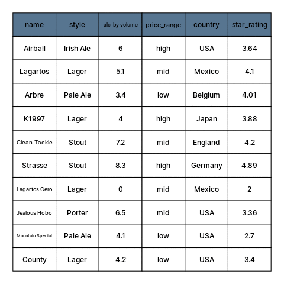
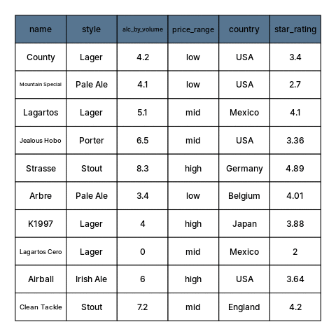
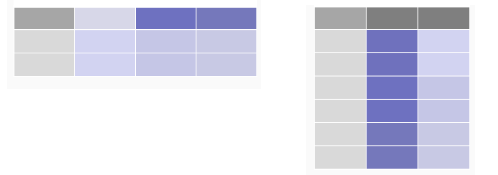
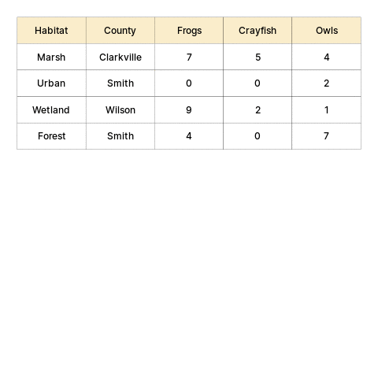
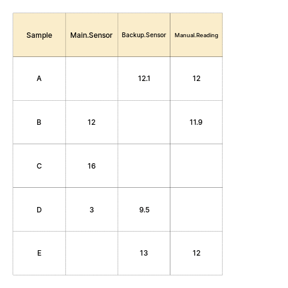

```{r child = "setup.Rmd"}
```

```{r xaringan-panelset, echo=FALSE, eval=TRUE}
xaringanExtra::use_panelset()
```

```{r imgs setup, echo=FALSE, eval=TRUE}
knitr::opts_chunk$set(fig.retina = 3, warning = FALSE, message = FALSE)

```

```{r xaringan-tachyons, echo=FALSE, eval=TRUE}
xaringanExtra::use_tachyons()
```

```{r, eval=TRUE, echo=FALSE}
library(gt)
library(dplyr)
library(tidyr)

```

class: center, middle, dk-section-title
background-image:url("images/casey-horner-KtlTvi8leYQ-unsplash.jpg")
background-size: cover
# Toolbox Refresher

---

## Tools for preparing, transforming, and restructuring data

.fl.w-40[
.tc[
📦 .large.b.rrured[`dplyr`]  
📦 .large.b.rrured[`tidyr`]  
]]

.fl.w-60[
.large[Part of the .b.rrured[`tidyverse`]]  

Flexible, but developed around built-in features that support a particular way of doing things  

]    

--

- Hard to use incorrectly by accident   
- Less code to achieve a goal  
- Shared grammar and input/output data structures  

---

## Pipes

To perform multiple operations in sequence:

.large[
- Nested code  

- Intermediate objects  

- Pipes  

]

---

# Nested code

```{r, eval=TRUE}
grades <- c(7,8,8,10,6,9,5,9,8)

round(mean(grades), digits = 2)
```

--

## Intermediate objects

```{r, eval=TRUE}
mn_grades <- mean(grades)

rd_mn_grades <- round(mn_grades, digits = 2)

rd_mn_grades
```

---

## Pipes

For structuring sequential operations left-to-right:

.fl.w-third[
.bt.bb[
Left Hand Side  
(.avenir[LHS])
]]


.fl.w-third[
.bt.bb[
`pipe operator`  
.b.orange[`%>%`] from  📦 .b.rrured[`magrittr`]
]]

.fl.w-third[
.bt.bb[
Right Hand Side  
(.avenir[RHS])
]]

--

</br></br></br></br>
- Take an **object** on the .avenir[Left Hand Side] of the pipe and insert it into a **function** as an argument on the .avenir[Right Hand Side] 

--

- By default, .avenir[LHS] is placed as the **first** argument in the call 

--

- Packages in the `tidyverse`  load .b.orange[`%>%`] automatically
---

## Pipes 

--

- Minimize the need for intermediate objects and nested code  

--

- Make code readable  

--

- Easy to add or remove steps at any point in the sequence of operations

--

> Insert with `ctrl + shift + M`

--

```{r, eval=TRUE}
library(magrittr)
grades %>% 
  mean %>% 
  round(digits=2)
```

---

# Useful 📦 .b.rrured[`dplyr`] functions

</br></br>

- Individual functions for the most common operations

- Each function does one only thing, but does it well  

--
- Intuitive, user-friendly functions for data manipulation
   - Subset columns
   - Subset rows
   - Create or modify columns  
 
---

```{r, echo=FALSE, eval=TRUE}
beers <- tibble::tribble(
               ~name,      ~style, ~alc_by_volume, ~price_range,  ~country, ~star_rating,
            "County",     "Lager",            4.2,        "low",     "USA",          3.4,
  "Mountain Special",  "Pale Ale",            4.1,        "low",     "USA",          2.7,
          "Lagartos",     "Lager",            5.1,        "mid",  "Mexico",          4.1,
      "Jealous Hobo",    "Porter",            6.5,        "mid",     "USA",         3.36,
           "Strasse",     "Stout",            8.3,       "high", "Germany",         4.89,
             "Arbre",  "Pale Ale",            3.4,        "low", "Belgium",         4.01,
             "K1997",     "Lager",              4,       "high",   "Japan",         3.88,
     "Lagartos Cero",     "Lager",              0,        "mid",  "Mexico",            2,
           "Airball", "Irish Ale",              6,       "high",     "USA",         3.64,
      "Clean Tackle",     "Stout",            7.2,        "mid", "England",          4.2
  )
```

.panelset[
.panel[.panel-name[beers]
```{r, echo=FALSE, eval=TRUE}
beers %>% gt() %>% 
  tab_options(table.background.color="#f4f4f9")
```
]

.panel[.panel-name[Data setup]
```{r panel-chunk, fig.show='hide'}
beers <- tibble::tribble(
               ~name,      ~style, ~alc_by_volume, ~price_range,  ~country, ~star_rating,
            "County",     "Lager",            4.2,        "low",     "USA",          3.4,
  "Mountain Special",  "Pale Ale",            4.1,        "low",     "USA",          2.7,
          "Lagartos",     "Lager",            5.1,        "mid",  "Mexico",          4.1,
      "Jealous Hobo",    "Porter",            6.5,        "mid",     "USA",         3.36,
           "Strasse",     "Stout",            8.3,       "high", "Germany",         4.89,
             "Arbre",  "Pale Ale",            3.4,        "low", "Belgium",         4.01,
             "K1997",     "Lager",              4,       "high",   "Japan",         3.88,
     "Lagartos Cero",     "Lager",              0,        "mid",  "Mexico",            2,
           "Airball", "Irish Ale",              6,       "high",     "USA",         3.64,
      "Clean Tackle",     "Stout",            7.2,        "mid", "England",          4.2
  )
```
]
]

---

.left-column[
.large.b[`select()`]
.large[Subset variables]

- by name  
- by position  
- by type  
]

.right-column[
```{r}
beers %>% select(name, style, star_rating)
```


]
---
.left-column[
.large.b[`mutate()`]
.large[Create and modify columns]

- create new  
- overwrite  
]

.right-column[
```{r}
beers %>% select(name, style, star_rating) %>% 
  mutate(stars = round(star_rating, digits = 0))
```


]
---
.left-column[
.large.b[`filter()`]
.large[subset rows]

- keep rows that meet a condition
]

.right-column[
```{r}
beers %>% select(name, style, star_rating) %>% 
  mutate(stars = round(star_rating, digits = 0)) %>% 
  filter(stars > 3)
```


]
---
class: my-turn
# My Turn

--

- .large[Load the mammal sleep data bundled with `ggplot2`]

--

- .large[Select the "name" and "conservation" columns, as well as all numeric variables]

--

- .large[Create a new column that contains the values of _'awake'_ multiplied by the values in _'brainwt'_]  

--

- .large[Filter the data to keep only rows with _'sleep_total'_ > 4]

--

> I'll use pipes to chain the operations 

---

class: inverse
# Your Turn

--

- .large[Load the mammal sleep data bundled with `ggplot2`]

--

- .large[Select "name" and "conservation" columns and those that include the string _'sleep'_ in their name]

--

- .large[Create a new column that contains the values of _'sleep_total'_ multiplied by 3]  

--

- .large[Filter the data to remove domesticated mammals]

--

> Use pipes to chain the operations!

---

class: center, middle, dk-section-title
background-image:url("images/emmanuel-acua-43Tvb651fxE-unsplash.jpg")
background-size: cover
# Working with Columns with `across()`

---

## Operating on multiple columns

###.center.b.large.orange[`across()`]

--

.large[`filter`, `mutate`, or `summarize` multiple columns]

- By position, name, or type  

--

- Compound selections of columns  
(e.g. _numeric columns that contain "mass" in their name_)

---

## .b.orange[`across()`] arguments:

--

.large.b[`.cols`] Columns to transform
 
--
 
.large.b[`.fns`]  Function to apply to each of the selected columns  

--

\* Expects a function, so function name and arguments can be passed separately

--

```{r}
beers %>% 
  mutate(across(c(alc_by_volume, star_rating), round, digits = 3))
```

---

## Useful column selection helpers
.ba.ph4[
.b.large.orange[`everything()`] Match all variables
]
</br>

--

.ba.ph4[
.b.large.orange[`!`] Take the complement of a set of variables (negate a selection)
]
</br>

--

.ba.ph4.mt1.mb1[
.b.large.orange[`where()`] Selects variables for which a predicate function returns `TRUE`  
> e.g. subset or transform all numeric variables, determined by `is.numeric()`
]

---

### Useful column selection helpers (continued)
.ba.ph4[
.b.large.orange[`matches()`] Match variable names with a regular expression
> e.g. drop variables with numbers in their name

]
</br>

--

.ba.ph4[
.b.large.orange[`:`] Select a range of consecutive variables
]
</br>

--

.ba.ph4[
.b.large.orange[`-`]   Exclude variables   
(return all elements except the one preceded by the subtraction operator)
]
---

`beers`

```{r, echo=FALSE, eval=TRUE}
beers %>% gt() %>% 
  tab_options(table.background.color="#f4f4f9")
```

---

#### Square root (.orange.b[`sqrt()`]) of `alc_by_volume` and `star_rating`
```{r, eval=TRUE}
beers %>% mutate(across(c(alc_by_volume,star_rating),sqrt))

```

---

#### Square root (.orange.b[`sqrt()`]) of all numeric variables
```{r, eval=TRUE}
beers %>% mutate(across(where(is.numeric),sqrt))
```

---
class: my-turn
# My Turn

--

- .large[Load the _midwest_ data bundled with `ggplot2`]

--

- .large[Keep only rows for Wisconsin (WI)]

--

- .large[Subset the 'county' column and all columns that match the string '_perc_' (hint: use a selection helper)]

--

- .large[log-transform all numeric variables]

--

- .large[Append the suffix "_check" to every value]

---

class: inverse
# Your Turn

--

- .large[Load the _midwest_ data bundled with `ggplot2`]

--

- .large[Keep only rows for Ohio (OH)]

--

- .large[Subset the 'county' column and all columns that match the string '_pop_' (hint: use a selection helper)]

--

- .large[Square-root transform all numeric variables]

---

class: center, middle, dk-section-title
background-image:url("images/1024px-Espacio_Escultórico.jpg")
background-size: cover
# Pivoting Data

---

.pull-left[
## Wide Data
Human-readable  
Easier entry  
Easier interactive editing
]
.pull.right[
## Long Data
Often meets Tidy Data principles  
Analysis-ready  
Maps well to plot axes and aesthetics ]




---
# Reshaping data with 📦 .b.rrured[`tidyr`]

.large[wide to long: .b.orange[`pivot_longer()`]]  

```{r}
pivot_longer(data, cols, names_to, values_to)
```

</br>
.large[long to wide: .b.orange[`pivot_wider()`]] 

```{r}
pivot_longer(data, cols, names_from, values_from)
```

---
```{r, echo=FALSE, eval=TRUE}
critters <- 
tibble::tribble(
   ~Habitat,      ~County, ~Frogs, ~Crayfish, ~Owls,
    "Marsh", "Clarkville",     7L,        5L,    4L,
    "Urban",      "Smith",     0L,        0L,    2L,
  "Wetland",     "Wilson",     9L,        2L,    1L,
   "Forest",      "Smith",     4L,        0L,    7L
  )
```

.panelset[
.panel[.panel-name[critters]
```{r, echo=FALSE, eval=TRUE}
critters%>% gt() %>% 
  tab_options(table.background.color="#f4f4f9")
```
]

.panel[.panel-name[Data setup]
```{r panel-chunk-critters, fig.show='hide'}
critters <- 
tibble::tribble(
   ~Habitat,      ~County, ~Frogs, ~Crayfish, ~Owls,
    "Marsh", "Clarkville",     7L,        5L,    4L,
    "Urban",      "Smith",     0L,        0L,    2L,
  "Wetland",     "Wilson",     9L,        2L,    1L,
   "Forest",      "Smith",     4L,        0L,    7L
  )
```
]
]

--

</br>
Variables:
- Habitat
- County
- Critter Type
- Individuals Encountered

---
# Wide to long

```{r}
critters_long <-
  critters %>%
  pivot_longer(
    cols = c(Frogs, Crayfish, Owls),
    names_to = "critter_type",
    values_to = "individuals_encountered"
  )
```

```{r, echo=FALSE, eval=TRUE}
critters_long <-
  critters %>%
  pivot_longer(
    cols = c(Frogs, Crayfish, Owls),
    names_to = "critter_type",
    values_to = "individuals_encountered"
  )
```


--

.b[`cols`] Which columns have data in their names  

--

**`names_to`** Name for the new column to be created from `cols`  

--

**`values_to`** Name of the column to be created from the contents of the cells in **`cols`**  

---
```{r, eval=TRUE}
critters %>%
  pivot_longer(cols = c(Frogs, Crayfish, Owls), 
               names_to = "critter_type", 
               values_to = "individuals_encountered")
```

---

# Long to wide

```{r}
critters_long %>% 
  pivot_wider(names_from = critter_type, 
              values_from = individuals_encountered)
```

--

.b[`names_from`] Which column's values will be used for new column names

--

**`values_from`** Which column has the cell values for the new output columns

---

```{r, eval=TRUE}
critters_long %>%
  pivot_wider(names_from = critter_type, 
              values_from = individuals_encountered)
```

---
class: center



---

class: my-turn
# My Turn

--

- .large[Load the dog ranks data ("dogranks_mine.csv")]  

--

- .large[Pivot the data (wide to long and back to wide)]

---

class: inverse
# Your Turn

--

- .large[Load the dog ranks data ("dogranks_your.csv")]  

--

- .large[Pivot the data (wide to long and back to wide)]

---

class: center, middle, dk-section-title
background-image:url("images/drew-dau-dXxsLrlg9qY-unsplash.jpg")
background-size: cover
# Coalescing Columns

---

## .b.orange[coalesce()] from 📦 .b.rrured[`dplyr`]  

--

- Find and return the first non-NA value at each position for a set of vectors

--

- Returns a single vector with the non-NA values that appear first 

--

```{r, eval=TRUE}
x <- c(1, 2, NA, NA, 5)
y <- c(NA, NA, 3, 4, 5)
z <- c(1, 4, 3, 5, 3)
```

--

```{r, eval=TRUE}
coalesce(x, y, z)
```

--

```{r, eval=TRUE}
coalesce(z,x,y)
```

---

```{r, eval=TRUE, echo=FALSE}
sensors <- 
tibble::tribble(
  ~Sample, ~Main.Sensor, ~Backup.Sensor, ~Manual.Reading,
      "A",           NA,           12.1,              12,
      "B",          12L,             NA,            11.9,
      "C",          16L,             NA,              NA,
      "D",           3L,            9.5,              NA,
      "E",           NA,             13,              12
  )
```

.panelset[
.panel[.panel-name[sensors]
```{r, echo=FALSE, eval=TRUE}
sensors %>% gt() %>% 
  tab_options(table.background.color="#f4f4f9")
```
]

.panel[.panel-name[Data setup]
```{r panel-chunk-sensors, fig.show='hide'}
sensors <- 
tibble::tribble(
  ~Sample, ~Main.Sensor, ~Backup.Sensor, ~Manual.Reading,
      "A",           NA,           12.1,              12,
      "B",          12L,             NA,            11.9,
      "C",          16L,             NA,              NA,
      "D",           3L,            9.5,              NA,
      "E",           NA,             13,              12
  )
```
]
]
---

</br>

```{r, eval=TRUE}
sensors %>% 
  mutate(Final.Reading=coalesce(Main.Sensor, Backup.Sensor, Manual.Reading))
  
```

---
class: center


---

class: center, middle, dk-section-title
background-image:url("images/sen-sathyamony-4RkmVyBMO5Q-unsplash.jpg")
background-size: cover
# Filling Adjacent Values

---

## .b.orange[fill()] from 📦 .b.rrured[`tidyr`]  
```{r, echo=FALSE, eval=TRUE}
animal_populations <- tibble(animal=c("Bird",NA,NA,NA,NA,"Frog",NA,NA,NA),
       population=c(21,5,7,23,74,23,65,12,5))
```

.fl.w-40[
```{r, eval=TRUE, echo=FALSE}
animal_populations %>% gt() %>% 
  tab_options(table.background.color="#f4f4f9")
```
]

</br>
`animal_populations`

--
j
.large[- Fill missing values in a column (top to bottom by default)]   

--

.large[- Contiguous/adjacent values assumed to be the same]   

--

.large[- Values only appear when they change along a column]

---
class: middle

```{r, eval=TRUE}
animal_populations %>% 
  fill(animal)
```

---
class: my-turn
# My Turn

--

.large[- Load the fish landings data 'fish-landings.csv']

--

.large[- Fill the 'Fish' and 'Lake' columns]

--

.large[- Create a new column, coalescing the three numeric variables]

---

class: inverse
# Your Turn

--

.large[- Load the fish landings data 'fish-landings.csv']

--

.large[- Fill the 'Fish' and 'Lake' columns]

--

.large[- Reorder the numeric variables ('Comission reported total' first) and create a new column, coalescing the three numeric variables]
