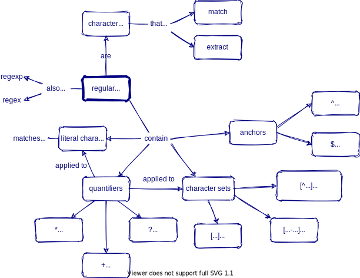
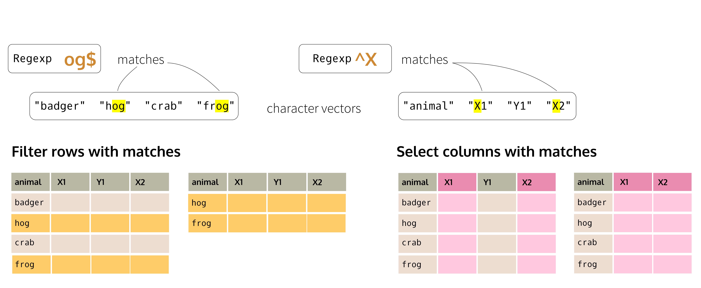

```{r child = "setup.Rmd"}
```

```{r xaringan-tachyons, echo=FALSE, eval=TRUE}
xaringanExtra::use_tachyons()
```

```{r html output, eval=TRUE, include=FALSE}
options(htmltools.dir.version = FALSE, htmltools.preserve.raw = FALSE)
```

```{r xaringan-panelset, echo=FALSE, eval=TRUE}
xaringanExtra::use_panelset()
```

```{r xaringan-extra-styles, eval=TRUE, echo=FALSE}
xaringanExtra::use_extra_styles(
  hover_code_line = TRUE,     
)
```

```{r imgs setup, echo=FALSE, eval=TRUE}
knitr::opts_chunk$set(fig.retina = 3, warning = FALSE, message = FALSE)

```

```{r xaringan-animate-all, echo=FALSE, eval=TRUE}
xaringanExtra::use_animate_all("fade")
```


```{r preloaded data, echo=FALSE, eval=TRUE}
library(palmerpenguins)
library(stringr)
library(dplyr)
library(ggplot2)
```

class: center, middle, dk-section-title
background-image:url("images/alex-iby-2JfOIZ1jR3M-unsplash.jpg")
background-size: cover
# What are Regular Expressions?

???

Having discussed data cleaning, tidy data, and data structures, now is a good time to learn about a tool that will come in handy when cleaning data, regardless of its structure or format and at every single stage of the process. So, in this lesson well be looking at regular expressions. 

Regular expressions, which are generally abbreviated as regex, R.E., or regexp, provide us with a concise language for describing patterns of text. 

---

class: middle

## Specially encoded 🧶.helvetica[_strings_] of characters that match patterns in other text strings 

???

To be precise, regular expressions are specially encoded text strings that match patterns in other strings. Regex has its own terminologies and syntax. In practice, it is a computer language in its own right, and it is usually bundled within many popular, programming languages. 

A regular expression matches a text pattern, It is input as a text string itself, and will compile into a mini program built specifically to identify that pattern. That pattern can be used to match, search, replace, or split text. 

---

## 🧶Strings

.large[
A collection of characters that make up one element of a vector:
```{r, eval=TRUE}
test_string <- "This sentence is a string."
```
]

???

In the context of R and for this course, string is a casual term that refers to a collection of characters that make up one element of a character vector. Formally, the object class that holds character strings in R is "character". Strings are enclosed in quotation marks. 

--

.large[
We can store multiple strings in a character vector:

```{r, eval=TRUE}
pets <-  c("dog","cat","parrot")
```
]

???

See how we can assign one or more strings to objects of class character.

---

## Strings

.pull-left[
.large[Headers and values in a data frame can also be strings:]]

```{r include=FALSE, eval=TRUE}
library(gt)
library(tibble)
library(magrittr)
drinks_df <- tibble(drink=c("Coffee","Tea","Juice"),price=c(3.50,2.99,3.20))
```

.pull-right[
```{r echo=FALSE, eval=TRUE}
drinks_df %>%
  gt() %>%
  tab_style(
    style = list(
      cell_fill(color = "yellow")
    ),
    locations = cells_body(
      columns = vars(drink)
    )
  ) %>%
  tab_options(column_labels.background.color = "yellow")
```
]

???

We need to be aware of this, because non-numeric values inside any rectangular R object with rows and columns (such as Data Frames, Tibbles, or Data Tables) are also strings, this includes variable names and list names, which are also always strings.

---

## Strings in R are _case sensitive_

Uppercase and lowercase letters are treated as distinct


```{r, eval=TRUE}
"cat"=="cat"
```

???

Like most UNIX based languages, R is case sensitive. This means that uppercase and lowercase letters are treated as distinct. 

--

```{r, eval=TRUE}
"cat"=="CAT"
```

???

To R, uppercase A and lowercase a are different symbols
cat in all lower case is not equal to CAT in upper case

---

### Regex searches are case sensitive by default

Our options:   

???

We care about this because by default, regex searches are case sensitive, so we need to be aware of lettercase when building regular expressions.

This is not an issue, because depending on what we need to accomplish, we can either 

--

- Build case-insensitive regular expressions  

???

build case insensitivity into our regular expressions, 

--

- Change the matching to be case insensitive  

???

turn off case sensitivity in the matching, 

--

- Coerce the input before matching

???

or modify the input text before matching. 

---

## Regex searches are case sensitive by default

Our options:   


.b.large[
- Build case-insensitive regular expressions  


- Change the matching to be case insensitive  ]


- .gray[Coerce the input before matching]

???

Of these options the first two are more advisable, because they save us steps and because once we learn the basics of regular expressions we can easily recognize case insensitivity.

---

class: center, middle

## Why Learn Regular Expressions?

???

Learning to write regular expressions is an underutilized, valuable skill. Regex provides us with a widely applicable and flexible tool for describing patterns in text strings, which can which can be very general or quite specific, and ultimately save us a lot of time when we need to match, extract, or transform text by matching words, characters, and patterns.

The syntax can look confusing at first, but like with the signs at airports or train stations, once we become familiar with the basics, we can get around even when we arrive somewhere we’ve never been, and in this context, when we come across regular expressions we haven’t seen before. 

--

.xl[🕰]

.large[Cleaning text can be **time-consuming** and the first hurdle to address when working with less-than-perfect data.]

???

Cleaning text is often the first major obstacle we have when working with less-than-perfect data.   

---

class: center, middle

## Why Learn Regular Expressions?

.xl[💻]

.large[      
Regular expressions can often **replace dozens of lines of code.**] 

???

Also, one well-written regular expression can often replace dozens of lines of programming code.

---

```{r, echo=FALSE, eval=TRUE, fig.align='left',out.width="40%"}
knitr::include_graphics("images/logos.png")
```

.large[
Regex is **not specific to any particular programming language or command-line tool.**]

???

And, regular expressions are not specific to any particular programming language or command-line tool. We only need to learn this once.

---

class: center, middle, dk-section-title
background-image:url("images/jorge-balleza-vtvwNNjYBz4-unsplash.jpg")
background-size: cover
# Understanding and Testing Regular Expressions

???

Lets get Started. Ill walk through some examples and explain how we can understand what’s happening when we use regex.

---

## Getting started

.fl.w-third[
<div class="f2 mt1 pt0 code">Regexp</div>
</br>
]

.fl.w-third[
<div class="f2 mt0 pt0 code">Input string</div>
</br>
]

.fl.w-third[
<div class="f2 mt0 pt0 code">Match</div>
</br>
]
</br>

???

There are two things we always need when we use regular expressions.  We provide an input string that may contain the pattern we’re interested in, and a regular expression to describe this pattern. 


Behind the scenes, the matching is done by regex engine, or a piece of specialized software embedded in many programming languages. R, Python, and Ruby (among many others) come with a regex engine ready to go. We do not access the engine directly, but the functions that take regular expressions as arguments call on it whenever its needed.  

When the matching is done, we’ll know if the regular expression found the pattern of interest in the input string.

--

</br></br>

To search for a specific sequence of characters, the regexp (regular expression) we need is simply that sequence of characters.


---

## Getting started


.fl.w-third[
<div class="f2 mt1 pt0 code">Regexp</div>
</br>
`dog`
]

.fl.w-third[
<div class="f2 mt0 pt0 code">Input string</div>
</br>
"The dog is fat."
]

.fl.w-third[
<div class="f2 mt0 pt0 code">Match</div>
</br>
The .bg-yellow[dog] is fat.

]

???

???

In a regular expression, most letters and characters will simply match themselves. "dog" tells the regex engine to find a d, immediately followed by an o, immediately followed by a g. (all characters together and in that order when read from left to right). This is similar to when we use the find tool in a word processor to look for words in our texts. 

---

class: center, middle


.large[✋ How can we tell if the regular expression is matching anything?]

???

In the previous example, the regular expression dog matched the string dog in the input text, and I showed you this match with some yellow highligting. Before we move on, now would be a good time to learn how we can test regular expressions and see if and how they are getting matches.

We have many options for this. If you have a web connection, I strongly suggest using online testers and debuggers.

---

## Online regex testers

???

When we’re starting out, and even after having memorized what the special characters do, it is often helpful to check and test our regular expressions before putting them in our code. There are many interactive tools that help us understand what is going on with the regular expression that we’re writing.

I’ll list some that I’m familiar with here and that I like for their simple user interface, but feel free to use any of the hundreds of testers out there.

--

- [rubular](https://rubular.com/) by Michael Lovitt  

???

The cleanest, most straightforward tester I know of is rubular, by Michael Lovitt. This is the one I’ll use for demonstration. These other testers are also good options so I’ll leave them here.

--

- [regex101](https://regex101.com/) by Firas Dib 

- [regexr](https://regexr.com/) by Grant Skinner 

- [regexpal](https://www.regexpal.com/) - part of Dan's Developer Tools 

---

## Inside R 

???

We can also test regular expressions within R. The regexplain package by Garrick Aden Buie runs inside Rstudio and works quite well, or we can call the str_view function from the stringr package to show us any matches. I personally prefer the online testers, but this is completely up to you.

--

- 📦 [`regexplain`](https://www.garrickadenbuie.com/project/regexplain/) by Garrick Aden‑Buie

- `str_view()` from 📦 .b.rrured[`stringr`]

---

## Regex Testers

```{r, echo=FALSE, eval=TRUE, fig.align='left',out.width="100%"}
knitr::include_graphics("images/regextester.png")
```

???

In general, interactive testers for regular expressions have three core components. 
A text box to write our regular expression, one for the input string, and a panel to display the matched patterns. 


---
class: inverse
## Your Turn

???

Now its your turn, in your web browser, navigate to either of these four interactive testers and have a look at its user interface.

--

Navigate to [rubular](https://rubular.com/), [regex101](https://regex101.com/), [regexr](https://regexr.com/), or [regexpal](https://www.regexpal.com/) and familiarize yourself with the user interface

???

Then paste the following into the box for the input text. You might recognize this text as part of a recipe.

--

Input the following text into the test string field: 

--

`
2 cups whole milk  
1 cup white rice (uncooked)  
1 pinch salt  
1/2 cup water  
1/4 cup dark brown sugar
`  

--

Write regular expressions (one at a time) to match the wet ingredients and look at the match results

???

Then, write regular expressions in the input field to match the wet ingredients, which would be  milk and water, and look at how the resulting matches are shown.

---

class: center, middle, dk-section-title
background-image:url("images/dfkt-nkynQWagL-s-unsplash.jpg")
background-size: cover
# Literal Characters and Metacharacters

???

Strings are made of characters, and so are regular expressions. For regular expressions, we can group characters into two classes depending on their behavior.

---

## Literal characters

We will get a match whenever the characters .orange[`d`], .orange[`o`], and .orange[`g`] occur consecutively in the input text.

???

If we are searching for occurrences of one specific sequence of characters, the regular expression to use is just that sequence of characters.

--

`"dog"` tells the regex engine:
find a .orange[d], immediately followed by an .orange[o], immediately followed by a .orange[g] (.b[together and in that particular order])

???

Lets look at the example from earlier, if our regular expresion is dog, the regex engine will look for a d, followed by an o, followed by a g, together an this exact order.

---

## Literal characters (continued)

.orange[`d`], .orange[`o`], and .orange[`g`] are examples of literal characters.

???

In this example, the d, o, and g in dog are literal characters. They stand exactly for what they are.

--

They stand for exactly what they are: .orange[`d`] in the regex matches a “.purple.b[d]” in the input text, .orange[`o`]  matches an “.purple.b[o]” in text, and so on.

---
class: middle

.large[The power and flexibility of regular expressions comes from their ability to describe more complex patterns.]

???

Searching for characters or consecutive sequences of characters or letters is useful, but the diversity of patterns that we can match with regex go far beyond just matching letters, digits, and any of the symbols on our keyboards.

--

.large[
If a text pattern can be described verbally, we can most likely write regular expression to match it.]

???

With regular expressions, if we can describe a pattern verbally, its very likely that we can write an expression to match it. 

---

### Possible patterns

???

This is what I mean. With a single regular expression, we can describe and match all kinds of patterns, which can be useful for data cleaning. These are verbal descriptions of the patterns we can easily match with regular expressions. 
For example

--

- "dog" but not "dogs"  

???

dog but not dogs, or 

--

- "dogs" but only if a string begins with "dogs"  

???

dogs but only if this match is at the start of the string,

--

- digits (0, 1, 2, 3, 4, 5, 6, 7, 8,  9)  

???

we can match digits without typing each one

--

- "modeling" or "modelling"  

???

or alternate spellings of the same word, 

--

- words ending in "at"

???


or words that begin or end with a specific pattern

--

- strings that start with digits

--

- dates

???

We can also look for dates in various formats

---

### Possible patterns

- zip codes

???

or zip codes

--

- numbers inside square brackets and also the brackets  

???

or find numbers if they are surrounded by brackets, what else, 

--

- valid Twitter handles (start with @, no spaces or symbols, <16 characters)

???

twitter handles, 

--

- UPPERCASE words

???

and words with different letter case, among many other things
--

- positions at which strings switch letter case (e.g. lowerUPPER)

???

To describe these patterns, we’ll use another type of characters, which have special meaning when they appear in a regular expression.

---

## Metacharacters
To match more than literal strings of text, we call on a small subset of characters that have special functionalities when they appear in a regular expression.

???

To do more than search for literal strings of text, we call on a few characters that take on special functionalities when they appear in a regular expression. These metacharacters do not stand for themselves, but instead are interpreted in a special way. 

--

.large[ 
Metacharacters include: .b.orange[[]\^$.|?*+()], which are reserved for unique matching purposes.
]

???

Metacharacters include: brackets, the caret, dollar sign, asterisk, plus, dot, and vertical bar. In regular expressions these characters are reserved for unique matching purposes.  These are the building blocks we need to code patterns that describe more complicated queries.

---
class: center, middle

## Most metacharacters fit into major "families"

???

Depending on what they do, we can place most metacharacters into major “families“

---

.large[
.b[Wildcards] stand in for unknown characters  
]

???

the dot character is a wildcard, it matches any character once

--

&nbsp; .f1.orange.pre[&nbsp;.&nbsp; ] &nbsp;&nbsp; match any character
***

--

.b.orange[f..l] matches ".b.bg-yellow[fill]" and ".b.bg-yellow[fool]", but not "flail"  

???

f dot dot l matches fill and fool, but not flail because the sequence we specified has two dots between the f and the l, and flail has three characters between the f and the l

--

.b.orange[.top] matches ".b.bg-yellow[stop]" and "is.b.bg-yellow[otop]e", but not "topple"  

???

the same thing happens with dot t o p, the dot can be anything, so we'll match stop and part of isotope

--

> note the substring match in "is**otop**e" 

---

.large[
.b[Character sets] match one or more characters inside the square brackets 
]

???

another useful metachacter family are Character sets. Character sets match any of the characters we put inside square brackets

--

&nbsp;.b.orange.pre[&nbsp;[ ] &nbsp;] &nbsp;&nbsp; match a set of characters  
***

--

.b.orange[[cb]at] matches ".b.bg-yellow[cat]", and ".b.bg-yellow[bat]", but not "rat"

???

if we write a regexp with a character set that contains c and b, followed by the literal string at. Well match cat and bat, but not rat because the letter r is not inside the character set.

--

.b.orange[[CK]at[iey]] matches ".b.bg-yellow[Caty]", ".b.bg-yellow[Kati]", ".b.bg-yellow[Katy]", and ".b.bg-yellow[Kate]"

???

In the next example, a single regexp matches many variations of the same string because we’re allowing many combinations of the letters inside the two character sets.

---

.large[
.b[Negation tokens]&nbsp;  
  
.orange.b[[^]] 	&nbsp;&nbsp; match characters not in the specified character set]

> `^` must be the first character inside the brackets

***

???

If we put a caret inside a character set, we can negate the set and match everything except whats inside the brackets.


--

.b.orange[[^aoeiou]] matches consonants

--

.b.orange[[^R]] matches everything except capital R

---

.large[
.b[Character ranges] indicate a series of sequential characters inside character sets 
]

Dash (.b.orange[\-]) inside a character set abbreviates alphabetical or numeric sequences 
***

???

Also, we can use the dash inside a character set to indicate a series of sequential characters. This applies to letters in the alphabet and to digits

--

.b.orange[[A-D]]  matches any single letter from A,B,C, or D (uppercase)

???

In one example we’ll be matching A,B,C or D, 

--

.b.orange[[5-8]]  &nbsp;matches any single digit between 5 and 8  

???

and in the other 5,6,7, or 8.

--

.b.orange[[A-Za-z]]  matches all alphabetical characters

???

Character sets are case sensitive, so to match all alphabetical characters we would specify a range from uppercase A through Z and lowercase a though z. 

--

> character ranges can also be negated with `^`

---

.large[
.b[Anchors] specify the relative position of the pattern being matched   
]

???

Another important family of metacharacters are anchors. We use these to specify the relative position of the patterns we want to match. 

--

&nbsp;.orange.large.pre[&nbsp;^&nbsp;] &nbsp;&nbsp;     starts with  
&nbsp;.large.orange.pre[&nbsp;$&nbsp;]  &nbsp;&nbsp; ends with  
***

???

The anchors are:
the caret, for specifying the start of a string, and the dollar sign to indicate the end.
IF you remember from just before, the caret works as a negation token, but only inside a character set. I you see it outside a pair of square brackets, assume its an anchor.

--

.b.orange[^mil] matches ".b.bg-yellow[mil]kshake" but not "family"  

???

Lets look at some examples,
a start anchor followed by m, I, L matches milkshake but not family, because the three-letter sequence is only at the start of the string in the case of milkshake.

--

.b.orange[ing$] matches "go.b.bg-yellow[ing]" but not "ingest"  

???

Same thing with the end anchor. I n g before a dollar sign restricts our match to strings that have this particular sequence at the end of the string.

--

> note the substring matches

---

class: inverse
### Your Turn
1\. Write a regexp that can match **tail**, **tool**, **tall**, and **toil**  
--

2\. How can we match **Jocelyn**, **Jocelin**, and **Joselyn** but not Jozelyn using character sets?

.fl.w-third.pa0[.tc[
a) Joscel[iy]n
]]
.fl.w-third.pa0[.tc[
b) Jo[sc^z]el[yi]n
]]
.fl.w-third.pa0[.tc[
c) Jo[sc]el[yi]n
]]

--

3\. Which of these regular expressions matches **`food`** at the beginning of a string?
.fl.w-25[.tl[
a) ^food
]]
.fl.w-25[.tl[
b) food
]]
.fl.w-25[.tl[
c) $food
]]
.fl.w-25[.tl[
d) food^
]]

---

.large[**Quantifiers** specify how many times a character or character class must appear in the input for a match to be found]

???

Lets look at another family of metacharacters that will really add power and flexibility to our regex. We use quantifiers to specify how many instances of a character or  character set  must be in the input for us to get a match. 

We can use a question mark, asterisk, plus, or curly brackets to specify how many times something has to be present in order to get a match. 

--

&nbsp;.f2[.orange.f1[&nbsp;?&nbsp;] &nbsp;&nbsp;Zero or one ]  	
&nbsp;.f2[.orange.f1[&nbsp;\\\*&nbsp;] &nbsp;&nbsp;Zero or more occurrences] 	
&nbsp;.f2[.orange.f1[&nbsp;+&nbsp;]	 &nbsp;&nbsp;One or more occurrences]   
&nbsp;.f2[.orange.f1[&nbsp;{}] 	&nbsp;&nbsp;Exactly the specified number of occurrences]  	

???

Question mark indicates zero or one
asterisk is for zero or more 
plus sign means one or more occurrences  	
and a number inside curly brackets lets us define a specific number of occurrences

--

> quantifiers apply to the preceding character

???

be aware that these metacharacters go after what we want to match. Quantifiers
match a certain quantity of the character or token immediately to its left.

---

### Quantifiers


.b.orange[modell?ing] matches ".b.bg-yellow[modeling]" and ".b.bg-yellow[modelling]"  

> zero or one `els (l)`

???

For example, we use the question mark here to match model then cero or one els, then ing, to match alternative spellings of the word modeling.

--

.b.orange[ya*y!] matches ".b.bg-yellow[yy!]", ".b.bg-yellow[yay!]", ".b.bg-yellow[yaaay!]", ".b.bg-yellow[yaaaaaay!]", etc.

> zero or more `aes (a)`

???

The asterisk after an a will match zero or more aes

---

### Quantifiers

.b.orange[no+] matches “.bg-yellow.b[no]”, “.bg-yellow.b[nooo]", ".bg-yellow.b[noooooo]", etc, but not “n”  

> one or more `oes (o)`

???

the plus sign is similar, but it matches one or more, in this case, one or more oes

--
 
.b.orange[e{2}] matches .“k.b.purple.bg-yellow[ee]p” and “b.b.purple.bg-yellow[ee]" but not “meat” 

> exactly two `ees (e)`

???

and finally we use curly braces here to match exactly two ees

---
class: inverse
### Your Turn

1\. Use a wildcard and a quantifier to match **cute**, **cuuute**, **cuuuuuute**, and **cuuuuuuuuute**  

--

2\. How can we match only Computer, computer, Computers, and computers?
.fl.w-third.pa0[.tc[
a) [cC]omputer[s]?
]]
.fl.w-third.pa0[.tc[
b) Computers+
]]
.fl.w-third.pa0[.tc[
c) [cC]omputer[s]+
]]


---

.large[
.b[Alternation] tokens separate a series of alternatives]  
.large[.orange.b.pre[&nbsp;|&nbsp;] &nbsp;&nbsp; either or
]
***

???

We have a few more families of metacharacters to look at. 
Alternation is a way to separates a series of alternatives. We simply use the vertical bar to separate two or more alternatives. 

--

.b.orange[dog|bird] matches ".b.purple.bg-yellow[dog]" or ".b.purple.bg-yellow[bird]"

.b.orange[gr(a|e)y] matches ".b.purple.bg-yellow[gray]" and ".b.purple.bg-yellow[grey]"
> note the alternation enclosed in brackets

???

In the first example we can match either dog or bird, and in the second one either a or e. 

---

.large[
.b[Special sequences and escapes]<br>
.b.orange.pre[&nbsp;\\&nbsp;] 	&nbsp;&nbsp; signals a shorthand sequence or gives special characters a literal meaning
]

???

Now, lets look at the backslash, which actually falls into two families of metacharacter. The backlash can either signal a special shorthand sequence, or it can give any of the special characters we’ve seen before a literal meaning. 

---

### Escapes
.b.orange[hello\\\\\\\\?] matches ".b.purple.bg-yellow[hello?]"

.large[
> question mark treated as a literal character, but in R escape the backslash first
]

???

Suppose we want to match a question mark, and not have it act as a quantifier. To do this, we precede it with a backslash. In this case, we say that the backslash is escaping the question mark.


Escapes look like this.
If we want to match a question mark we escape it with a backslash, and in R, we escape the backslash with another backslash just because R has its own interpretation of the backslash. By escaping the backslash, we tell R to pass it along to the regex engine and this will then escape our character of interest.

--

_Metacharacters inside a character set are stripped of their special nature_

???

Also, if we use metacharacters inside a character set, we dont need to escape them, they will be treated as literal characters.

---

.large[.b[Shorthand sequences] are available to refer to commonly-used character sets
]

???

The other use of the backslash is to refer to some character sets that are used so frequently that they have their own shorthand. 

--

.b.orange[\w] &nbsp;letters, underscore, and numbers  <br>
.b.orange[\d] &nbsp;digits<br>
.orange.b[\t]  &nbsp;&nbsp; tab &nbsp;&nbsp;&nbsp;&nbsp;&nbsp;&nbsp;&nbsp;&nbsp;&nbsp;&nbsp;&nbsp;&nbsp;&nbsp;&nbsp;&nbsp;&nbsp;&nbsp;&nbsp;&nbsp;&nbsp; .orange.b[\n]  &nbsp; new line &nbsp; &nbsp;&nbsp;&nbsp;&nbsp;&nbsp;&nbsp;&nbsp;&nbsp;&nbsp; .orange.b[\s]  &nbsp;space<br>
.orange.b[\b]  &nbsp;word boundary<br>

>.small[Predefined character classes help us avoid malformed character sets]

???

Some are quite simple, like using backlash d to refer to all digits between cero and nine, or backslash s to refer to space. Others are more involved, and well go over these next.

---

### Word boundaries .b.orange[`\\b`]

???

First, word boundaries, which we write as backslash b. 

--

Match **positions** between a _word_ character (letter, digit or underscore) and a non-word character (usually a space or the start/end of a string).
*** 

???

Word boundaries match positions, not any particular character that prints on the screen. This shorthand sequence will help us match the position between a word character, which includes letters and digits, and non-words, which are usually space or the start or end of a string.

--

> Before a sequence of word characters

.b.orange[\\bcase] matches ".b.bg-yellow.purple[case]" and "two .b.bg-yellow.purple[case]s" but not "suitcase"  

--

> After a sequene of word characters

.b.orange[org\\b] matches "cyb.b.bg-yellow.purple[org] rebellion" but not "organic"


---

### _Word_ characters .b.orange[`\\w`]

???

Now, onto word characters, which we write as backslash w. 

--

Matches any character (letter, digit or underscore). Useful in combination with word boundaries and quantifiers.
***  

???

This matches all letters, digits, and the underscore character.

--

Equivalent to .orange[\[a-zA-Z0-9_\]]

--

.b.orange[\\w] matches letters (case insensitive), numbers, and underscores in:

.b.bg-yellow.purple[F33d].%.b.bg-yellow.purple[the_mÖusE] .b.bg-yellow.purple[pl]@.b.bg-yellow.purple[ase]!!# 


---

class: inverse
### Your Turn

Enter "That athlete is at the squat rack" as the test string in a regex tester.

--

Why are the matches different with the following three regular expressions?
 
 a) at  
 b) \bat  
 c) at\b

---

class: center, middle, dk-section-title
background-image:url("images/dan-gold-4YAhiaZkUfs-unsplash.jpg")
background-size: cover
# Combining metacharacters 

???

The real power of regex comes from combining literal and metacharacters to describe patterns. Lets see how the metacharacters we learned can be used together.

---

## Anchor, wildcard with quantifier (0 or more)

.b.orange[^can.\\\*] matches ".b.purple.bg-yellow[can]", ".b.purple.bg-yellow[can]ine", ".b.purple.bg-yellow[can]oli", and ".b.purple.bg-yellow[can]adian"

##  Wildcard and quantifier
.b.orange[A.\\*x] strings that start with "**A**" and end with "**x**"

???

Here, were matching the literal characters c, a, and n, at the start of a string followed by cero or more of a wildcard character. This will match any string that starts with can followed by anything else.

This other regexp matches strings that start with a capital A and end with x, with anything in between.

---

## Shorthand sequence (space) and quantifier

.b.orange[\\s{3}] matches three spaces 

???

We can also combine a shorthand sequence with an exact quantifier.

--

## Anchors, character set, and quantifier (one or more) 

.b.orange[^[a-z]+$] matches a lowercase string

???

The second example has start and end anchors, a character set with only lowercase letters, and a quantifier for one or more ocurrences. In short this regular expression matches lowercase strings of any length.

---

## Word characters, quantifiers, word boundaries, and anchors

.b.orange[\w+\b$] matches the last word in a string

"Fix the .b.purple.bg-yellow[car]."  
"12 .b.purple.bg-yellow[eggs]"

.b.orange[^\w+\b] matches the first word in a string

".b.purple.bg-yellow[Fix] the car."  
".b.purple.bg-yellow[12] eggs"

???

These next examples combine word characters, word boundaries, quantifiers and anchors to match either the last or the first word in a string, regardless of what these words are.	

---

```{r, echo=FALSE, eval=TRUE, fig.align='center', out.width='66%'}

```
</br>
.center.small[Modified from '[Regular Expressions](https://github.com/rstudio/concept-maps/#regular-expressions)' concept map by Greg Wilson]

???

We are almost ready to start using regular expressions in R, but first I want to leave this concept map for regular expressions here. It summarizes most of what we’ve covered so far.

Its now my turn to write some regex from scratch. I’ll do it in an interactive tester like before for each of these patterns. 

---

class: my-turn
## My Turn

Write regular expressions for the patterns below and test them in an interactive tool:

1. "dogs" but only if string begins with "dogs"  
2. strings that start with digits  
3. UPPERCASE strings  
4. numbers in brackets  
5. strings that end in “at” but longer than 3 characters   


---
class: inverse
## Your Turn

Write regular expressions to match the following, making sure they work in an interactive regex tester:

1. cute, cuuute, cuuuuuute, and cuuuuuuuuute 
2. strings with both letters and digits
3. strings ending in a period
4. lowercase strings
5. exactly four digits
6. strings without the letter _**s**_

---
class: center, middle, dk-section-title
background-image:url("images/joakim-honkasalo-1LEq1hqDxEg-unsplash.jpg")
background-size: cover
# Regex in R

???

Now that we have a handle on regular expressions, we can see how this fits into our workflows in R.

---

Variable names and values in columns of type `character` can be matched with regular expressions in common data transformations, including data cleaning.

???

First up, in the context of working with rectangular data, remember that variable names and anything that is not of class numeric is a string, which we can match flexibly with regular expressions. 

--

```{r, echo=FALSE, eval=TRUE, fig.align='center', out.width='95%'}

```

???

In this figure, I summarized two examples of common data transformations in which regular expressions are used. In one, a single regexp matches many values in a variable for subsetting rows. In the other one, on the right, columns are selected with a regular expression that matches part of the column names. 

---

# 📦 .rrured[`stringr`]

Cohesive set of functions for string manipulation

???

R comes well-equipped for performing most string operations, but the syntax for the built-in functions that take regular expression is not always consistent, which makes them slower to learn and memorize. To get around this, we can use the stringr package. stringr provides a cohesive set of functions for string manipulation. 

--

- Function names start with .b[`str_`]   

???

Function names in stringr are informative, they all start with the str_ prefix, and they use consistent argument names.

--

- All functions take a vector of strings as the first argument (pipe-friendly)  

???

Stringr is part of the tidyverse suite of packages, so by design it works well with the pipe operator and integrates with packages we often use for preparing and cleaning data. In fact, all functions in stringr take a vector of strings as the first argument, which makes them pipe-friendy.

--

**`regex()`** modifier to control matching behavior

.content-box-gray[`ignore_case=TRUE` will make matches case insensitive]

???

Additionally, functions in stringr have extra arguments for precise control of matching behavior, including an argument for ignoring letter case and making matches case insensitive.

---

## `stringr` examples

???

Now we can look at some examples of stringr functions and how they work.

--

**Matches?**

```{r, eval=TRUE}
str_detect(string = c("catalog", "battlecat", "apple"), pattern = "cat")
```

???

To detect matches we can use the SRT detect function, which as the name implies detects is a pattern, described by a regular expression, is present in a character string. The output is a logical, TRUE or FALSE vector of the same length as our input string.

---

## `stringr` examples

**Which elements contain matches?**

```{r, eval=TRUE}
str_which(string = c("catalog", "battlecat", "apple"), pattern = "cat")
```

???

We may also want to know which elements are the ones that match. For this we use STR which, which will give us the index for each of the matching elements.

---

## `stringr` examples

**Replacing matches**

```{r, eval=TRUE}
str_replace(string = c("colour", "neighbour", "honour"),
            pattern = "ou",
            replacement = "o")
```

???

To go ahead and replace matches with something else, we can use str replace. It has an additional argument for our replacement, and in the example, we replace ou with just o to go from british to american spelling. The result is the input vector but with any matches replaced.

---

## `stringr` examples

**Case insensitive matching**

```{r, eval=FALSE}
str_replace(string = c("colOur", "neighboUr", "honOUr"),
            pattern = regex("ou", ignore_case = TRUE),   
            replacement = "o") 
```

???

This is the same example, but with case insensitive matching. 

---

## `stringr` examples

**Case insensitive matching**

```{r, eval=FALSE}
str_replace(string = c("colOur", "neighboUr", "honOUr"),
            pattern = regex("ou", ignore_case = TRUE),  #<< 
            replacement = "o") 
```

???

The input string has a mix of upper and lower case letters, but if we want we can ignore letter case and do the replacements anyway. 

---

## `stringr` examples

**Case insensitive matching**

```{r, eval=FALSE}
str_replace(string = c("colOur", "neighboUr", "honOUr"),
            pattern = regex("ou", ignore_case = TRUE),  #<< 
            replacement = "o") 
```

```{r, eval=TRUE, echo=FALSE}
str_replace(string = c("colOur", "neighboUr", "honOUr"),
            pattern = regex("ou", ignore_case = TRUE),
            replacement = "o") 
```

???

To do this, we put our pattern argument inside the regex function and set the ignore case argument to TRUE. This gives us the same output as before.

---

class: inverse

## Your Turn

Match the following regular expressions against the test vector below using `str_detect`.  Can you explain the matches?

Regular expressions
1. ^dog
2. ^[a-z]+$
3. \\\\\d


```{r}
test_vector <- c("Those dogs are small.","dogs and cats",
                 "34","(34)","rat","watchdog","placemat",
                 "BABY","2011_April","mice")
```

---

class: center, middle, dk-section-title
background-image:url("images/patrick-janser-YGP2NAGaBwc-unsplash.jpg")
background-size: cover
# Regular Expressions and Data Cleaning

---

## Using regular expressions in data cleaning

???

We covered how the stringr functions help us match patterns in input strings, but now we will really land on how regex can help us work with cleaning messy data and do so efficiently.

In general, there are two main uses for regular expressions when we have data in a rectangular structure with rows and columns, and we are trying to make it usable.

--

.large[
Select, subset, keep, or discard rows and columns
]

???

First we can modify, keep, or discard rows or columns that contain a pattern we are interested in.

--

.large[   
Substitute or recode values
]

???

Another major use case is replacing, or recoding values. For example, recoding strings with multiple alternate spellings.

--

.large[
Extract or remove substrings
]

???

Or we can also use it to clean values in the data by extracting or removing pieces of character strings.

---

## Cleaning data with regex

To select variables in 📦 .b.rrured[`dplyr`] and 📦 .b.rrured[`tidyr`], we:

???

Lets start by looking at how we can use regular expression to select columns, because most data cleaning workflows involve specifying variables to work on.

To select varibles in dplyr and tidyr, two tidyverse packages that we use often for cleaning and transforming data, we have several options. You may remember this from a previous lesson on restructuring data.

--

- write out their names   

???

One, we can refer to them by name

--

- refer to them by position  

???

or by position, which I dont recommend,

--

- specify ranges of contiguous variables

???

also, we can specify ranges of continuous variables 
now Id like to introduce a fourth option, which actually takes regular expressions.

--

- .large[use 📦 .b.rrured[`tidyselect`] helper functions]

???

We can use tidyselect functions to refer to columns in our data.

---

## 📦 .rrured.b[`tidyselect`] helpers

???

Tidyselect is a package that works behind the scenes to provide functions that help us select variables when working with various tidyverse packages. Of the many functions provided by tidyselect, there are four built specifcally to select variables by matching patterns in their names.

--

.b[`matches()`] takes regular expressions, and selects variables that match a given pattern

???

The ‘matches’ function takes regular expressions and selects variables that match our pattern of interest.

--

**`starts_with()`**: Starts with a prefix  

???

We can also select variables that start with a specific string,

--

**`ends_with()`**: Ends with a suffix  

???

end with a specific suffix, 

--

**`contains()`**: Contains a literal string 

???

or simply that contain a string.

---

## 📦 .rrured.b[`tidyselect`] helpers


.b[`matches()`] takes regular expressions, and selects variables that match a given pattern


.gray[
**`starts_with()`**: Starts with a prefix  
]

.gray[
**`ends_with()`**: Ends with a suffix  
]

.gray[
**`contains()`**: Contains a literal string 
]

???

If we recall what we learned earlier, regular expressions can match the start and end of a string, and we know of literal characters now, so we will focus on the matches function. However, these other functions can be useful shortcuts if you want to write code for someone unfamiliar with regular expressions. Lets try this out.

---

### Selecting columns by name

`penguins` data from 📦 .rrured.b[`palmerpenguins`]

```{r, eval=TRUE}
names(penguins)
```

???

This example uses the penguins data from the palmerpenguins package. Here we will be selecting some columns. 

We can print the names of the variables in the data with the names argument.

Lets say we want to subset the data and keep the species column,  and only those columns that measure the length of some part of the penguins. 

--

```{r, eval=TRUE}
penguins %>% 
  select(species, bill_length_mm, flipper_length_mm) %>% sample_n(3)
```

???

Looking at the list of names, I recognize two length measurements: bill length and flipper length.

One option is to simply write out the variable names in the select function from dplyr. In the second piece of code, we select species and the two length measurements by writing out their names, and for display purposes were printing three rows at random.

---

### Selecting columns by matches in variable names

```{r, eval=TRUE}
names(penguins)
```

```{r, eval=TRUE}
penguins %>% 
  select(species, matches("length")) %>% 
  sample_n(3)
```

???

Alternatively, we can use the matches helper and search for the literal string length. The text in quotes inside matches is a regular expression. This gives the same result as using “contains” helper, which is meant for literals 

---

### Match values and filter rows

???

Another common transformation that we use in data cleaning is to filter rows according to values in a variable. We can also use regular expressions for flexible matching to either keep or discard rows.

--

Mammals sleep dataset (`msleep`) from 📦 .rrured.b[`ggplot2`]

```{r, eval=FALSE}
library(ggplot2)
```

```{r, eval=TRUE}
msleep %>% select(name,genus) %>% sample_n(7)
```

???

This examples uses the mammal sleep dataset that comes with ggplot2

Here I’m selecting two columns, the common and the scientific name of the sleepy mammals just for a quick glimpse of these two columns. I’m printing seven rows at random, but the data has 83 different species. 

---

### Match values and filter rows

Filter to keep rats only

```{r, eval=TRUE}
msleep %>% 
  select(name,genus) %>% 
  filter(str_detect(string = name,pattern = "rat"))
```

???

Lets say we only want rows in which the common name includes the string “rat”. After selecting our columns of interest we can use str_detect inside the filter function from dplyr to to match the literal string rat in the common names. Remember that str detect gives us a logical vector, so the filter function will keep only those rows for which the condition we evaluated was TRUE, that is, the name contained the string rat.

---

class: inverse

# Your Turn

.large[🐀 After running the code below, how can we exclude muskrats from the matches?]

```{r, eval=FALSE}
msleep %>% 
  select(name,genus) %>% 
  filter(str_detect(string = name,pattern = "rat"))
```

---

```{r, eval=TRUE, echo=FALSE}
companies <- data.frame(
  stringsAsFactors = FALSE,
           Company = c("Olsson","Ollsson","olson",
                       "Olsson LLC","Olsson Group","Olsonn","Mila Inc",
                       "Mila Inc","Mila Inc"),
         Operation = c("Logistics","Logistics",
                       "Logistics","Logistics","Logistics","Logistics",
                       "E-commerce","E-commerce","E-commerce")
)
```


## Substitute or recode values

.panelset[
.panel[.panel-name[companies]

```{r panel-chunk comps, fig.show='hide', eval=TRUE, echo=FALSE}
companies %>% gt::gt() %>%   tab_style(
    cell_text(size = '17px'),
    locations = list(cells_body(),
                     cells_column_labels(everything()),
                     cells_title()))
```
]

.panel[.panel-name[Data setup]
```{r, fig.show='hide'}
companies <- data.frame(
  stringsAsFactors = FALSE,
           Company = c("Olsson","Ollsson","olson",
                       "Olsson LLC","Olsson Group","Olsonn","Mila Inc",
                       "Mila Inc","Mila Inc"),
         Operation = c("Logistics","Logistics",
                       "Logistics","Logistics","Logistics","Logistics",
                       "E-commerce","E-commerce","E-commerce")
)
```
]
]

???

This next use of regular expressions is particularly useful for data cleaning, since we often find ourselves replacing values to deal with unwanted variation within our data.


This object called ‘companies’ has names and descriptions for two fake companies, and for one of the company names there are some variants and misspellings. We can use regular expressions to get rid of this bloat.

And in fact, we can match all these options with a single regexp

---

## Substitute or recode values
.i[(correct name should be Olsson)]  
```{r, eval=TRUE}
companies %>% 
  mutate(Company=str_replace(Company,"[o|O]l+s+on+.*","Olsson")) %>% 
  distinct()
```

???

Lets break down whats happening in this code block.

First, notice that I used the mutate function from dplyr, which creates new columns, and in this case, is overwriting an existing one. Inside mutate, I used str replace to match a pattern and replace it with what I knew the correct name should be.

The arguments in str replace are string, pattern, and replacement. In this case string is the column with the company names, pattern is a regular expression, and replacement is what we want the matches to be replaced by.

The regular expression starts with a character set, the square brackets, in which I want to match either lowecase O or uppercase O. after that the plus sign is for matching one or more of the letters to their left, so that we can allow for different spellings of the same name, and the regexp ends with a dot and an asterisk, to match anything else after the first word in our input string. When this ran, it matched all the variants of Olsson and replaced them with the correct spelling I specified as the replacement.  After that, the distinct function got rid of all the duplicate entries, and we will learn more about this function and de-duplication in the next lesson.

---

## Case insensitive matching

```{r, eval=TRUE}
companies %>%
  mutate(Company = str_replace(
    Company,
    regex("ol+s+on+.*", ignore_case = TRUE), "Olsson"
  )) %>%
  distinct()
```

???

The same code from before can be run using case insensitive matching instead of the character set with alternation that I used earlier, I think this option is actually better and the final result is the same.

---

```{r, eval=TRUE, echo = FALSE}
team_record <- 
tibble::tribble(
  ~week,               ~result,  ~game,
    12L,                "loss", "home",
    13L, "loss (disqualified)", "away",
    14L,    "win (overturned)", "away",
    15L,       "win (forefit)", "home",
    16L,       "win (rematch)", "away"
  )

```

## Extract or remove substrings  

???

To wrap up this section, let’s see how we can extract or remove substrings, which are simply parts of a string.

--

.panelset[
.panel[.panel-name[team_record]
```{r, fig.show='hide', eval=TRUE, echo=FALSE}
team_record %>% gt::gt()  %>% tab_style(
    cell_text(size = '17px'),
    locations = list(cells_body(),
                     cells_column_labels(everything()),
                     cells_title()))
```
]
.panel[.panel-name[Data setup]
```{r, fig.show='hide'}
team_record <- 
tibble::tribble(
  ~week,               ~result,  ~game,
    12L,                "loss", "home",
    13L, "loss (disqualified)", "away",
    14L,    "win (overturned)", "away",
    15L,       "win (forefit)", "home",
    16L,       "win (rematch)", "away"
  )
```
]
]

???

This data object here is called ‘team record’, it has three columns. Week, result, and game. There is some extra information in parenthesis in the result column, which we might want to either put in a separate column, or remove.

--

.b.purple[`str_extract()`] extracts matching patterns  
.b.purple[`str_remove()`]  removes matched patterns

???

To do this, we use to functions from stringr.
str_extract, to extract substrings, o str_remove, to remove parts of a string

---

### Extract substrings

```{r, eval=TRUE}
team_record %>%
  mutate(result_comment = str_extract(string = result, pattern = "\\(.+\\)"))
```

???

Lets start with extraction.
str_extract follows the same stringr syntax. First argument is an input string, and second one is a pattern, described by a regular expression. If we want to extract the additional information thats inside the parentheses, we use escapes for the parenthesis because they also have a special meaning in regular expressions, and inside the escaped parenthesis we have a dot and a plus signs. This means match one or more of anything inside the parenthesis. We’re using str_extract inside mutate to create a new column, which I named result underscore comment. If we look at the resulting column, the comments about each result were put into the new column, and when there was no match an NA was introduced. 

--

*Can we strip the parentheses with a regular expression?*

???

We dont need the parentheses in the new column, so how can we get rid of them.

---

### Remove the parentheses
.large.b.purple[`str_remove_all()`]
```{r, eval=TRUE}
team_record %>%
  mutate(result_comment = str_extract(string = result, pattern = "\\(.+\\)")) %>% 
  mutate(result_comment = str_remove_all(result_comment,"[()]"))
```

???

To remove the parentheses from the result comment column, we use str_remove all. The syntax is the same. Look at the regular expression used to describe what we want to remove. Its simply the opening and closing parenthesis inside a character set, and because theyre in a character set they do not need to be escaped. Now we use mutate to overwrite the new column, stripping away everything we defined in the character set.

Two quick notes here. 
Str remove all is a version of str remove that removes all matches and not just the first instance it finds. Also, I mentioned escaping the parenthesis to treat them as literal characters, but I never explained what they do when we use them as metacharacters. Parenthesis in regular expressions are used to define capture groups, which are beyond the scope of this course but feel free to read about them in the sources I collated under the read more materials for this lesson.

---

### Remove substrings

```{r, eval=TRUE}
team_record %>%
  mutate(result=str_remove(
    string= result,pattern = " \\(.*\\)"))
```

???

Lastly, If we only wanted to remove the comments from the result column, we could also do it by removing the parentheses and everything inside them with a single regexp inside str_remove.

---

class: my-turn
# My Turn

1. Download CRAN package descriptions  

--

2. Select Package name, author, description, and all variables that contain 'License'  

--

3. Filter rows for packages with names that:  

--

 - start with _gg_ (case insensitivty)
 
--
 
 - contain _Bayes_
 
--

 - contain _glm_ but not _glmm_

---
class: inverse
# Your Turn

1. Download CRAN package descriptions  

--

2. Select package name, author, description, and all variables that end in 'ports'  

--

3. Filter rows for packages with names that: 

--

 - end in _plot_

--

 - contain _Bayes_

--

 - contain digits  

--

 - are all UPPER CASE