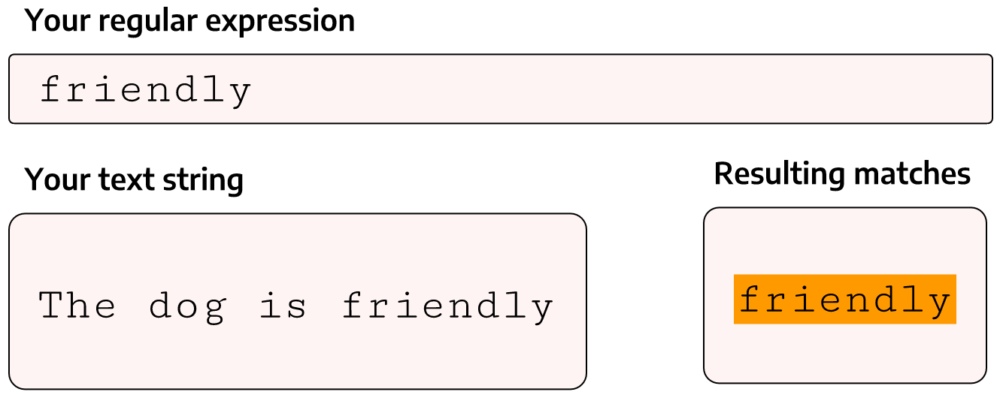

```{r child = "setup.Rmd"}
```

```{r xaringan-tachyons, echo=FALSE, eval=TRUE}
xaringanExtra::use_tachyons()
```

```{r html output, eval=TRUE, include=FALSE}
options(htmltools.dir.version = FALSE, htmltools.preserve.raw = FALSE)
```

```{r xaringan-panelset, echo=FALSE, eval=TRUE}
xaringanExtra::use_panelset()
```

```{r imgs setup, echo=FALSE, eval=TRUE}
knitr::opts_chunk$set(fig.retina = 3, warning = FALSE, message = FALSE)

```

```{r preloaded data, echo=FALSE, eval=TRUE}
library(palmerpenguins)
library(stringr)
library(dplyr)
library(ggplot2)
```

class: center, middle, dk-section-title
background-image:url("images/alex-iby-2JfOIZ1jR3M-unsplash.jpg")
background-size: cover
# What are Regular Expressions?

---

class: middle

## Specially encoded 🧶.helvetica[_strings_] of characters that match patterns in other text strings 

---

## 🧶Strings

.large[
A collection of characters that make up one element of a vector:
```{r, eval=TRUE}
test_string <- "This sentence is a string."
```
]
--

.large[
We can store multiple strings in a character vector:

```{r, eval=TRUE}
pets <-  c("dog","cat","parrot")
```
]

---

## Strings

.pull-left[
.large[Headers and values in a data frame can also be strings:]]

```{r include=FALSE, eval=TRUE}
library(gt)
library(tibble)
library(magrittr)
drinks_df <- tibble(drink=c("Coffee","Tea","Juice"),price=c(3.50,2.99,3.20))
```

.pull-right[
```{r echo=FALSE, eval=TRUE}
drinks_df %>%
  gt() %>%
  tab_style(
    style = list(
      cell_fill(color = "yellow")
    ),
    locations = cells_body(
      columns = vars(drink)
    )
  ) %>%
  tab_options(column_labels.background.color = "yellow")
```
]

---

## Strings in R are _case sensitive_

Uppercase and lowercase letters are treated as distinct


```{r, eval=TRUE}
"cat"=="cat"
```

--

```{r, eval=TRUE}
"cat"=="CAT"
```


---
### Regex searches are case sensitive by default

Our options:   

--

- Build case-insensitive regular expressions  

--

- Change the matching to be case insensitive  

--

- Coerce the input before matching

---

## Regex searches are case sensitive by default

Our options:   


.b.large[
- Build case-insensitive regular expressions  


- Change the matching to be case insensitive  ]


- .gray[Coerce the input before matching]


---

class: center, middle

## Why Learn Regular Expressions?


.xl[🕰]

.large[Cleaning text can be **time-consuming** and the first hurdle to address when working with less-than-perfect data.]

---

class: center, middle

## Why Learn Regular Expressions?

.xl[💻]

.large[      
Regular expressions can often **replace dozens of lines of code.**] 

---

```{r, echo=FALSE, eval=TRUE, fig.align='left',out.width="40%"}

```

.large[
Regex is **not specific to any particular programming language or command-line tool.**]


---

class: center, middle, dk-section-title
background-image:url("images/jorge-balleza-vtvwNNjYBz4-unsplash.jpg")
background-size: cover
# Understanding and Testing Regular Expressions

---

## Getting started
To search for a specific sequence of characters, the regexp (regular expression) we need is simply that sequence of characters.

.fl.w-third[
<div class="f2 mt1 pt0 code">Regexp</div>
</br>
`dog`
]

.fl.w-third[
<div class="f2 mt0 pt0 code">Input string</div>
</br>
"The dog is fat."
]

.fl.w-third[
<div class="f2 mt0 pt0 code">Match</div>
</br>
The .bg-yellow[dog] is fat.

]

---

class: center, middle

.xl[🛑 Hold on]

.large[✋ How can we tell if the regular expression is matching anything?]

  
---

## Online regex testers

--

- [rubular](https://rubular.com/) by Michael Lovitt  

--

- [regex101](https://regex101.com/) by Firas Dib 

--

- [regexr](https://regexr.com/) by Grant Skinner 

--

- [regexpal](https://www.regexpal.com/) - part of Dan's Developer Tools 


---

## Inside R 

- 📦 [`regexplain`](https://www.garrickadenbuie.com/project/regexplain/) by Garrick Aden‑Buie

--

- `str_view()` from 📦 .b.rrured[`stringr`]

---
## Regex Testers

```{r, echo=FALSE, eval=TRUE, fig.align='left',out.width="100%"}

```

---
class: inverse
## Your Turn

--

Navigate to 
[regex101](https://regex101.com/), [regexr](https://regexr.com/), or [regexpal](https://www.regexpal.com/) and familiarize yourself with the user interface

--

Input the following text into the test string field: 

--

`
2 cups whole milk  
1 cup white rice (uncooked)  
1 pinch salt  
1/2 cup water  
1/4 cup dark brown sugar
`  

--

Write regular expressions (one at a time) to match the wet ingredients and look at the match results

---

class: center, middle, dk-section-title
background-image:url("images/dfkt-nkynQWagL-s-unsplash.jpg")
background-size: cover
# Literal Characters and Metacharacters

---

## Literal characters

We will get a match whenever the characters .orange[`d`], .orange[`o`], and .orange[`g`] occur consecutively in the input text.

--

`"dog"` tells the regex engine:
find a .orange[d], immediately followed by an .orange[o], immediately followed by a .orange[g] (.b[together and in that particular order])

---

## Literal characters (continued)

.orange[`d`], .orange[`o`], and .orange[`g`] are examples of literal characters.

--

They stand for exactly what they are: .orange[`d`] in the regex matches a “.purple.b[d]” in the input text, .orange[`o`]  matches an “.purple.b[o]” in text, and so on.

---
class: middle

.large[The power and flexibility of regular expressions comes from their ability to describe more complex patterns.]

--

.large[
If a text pattern can be described verbally, we can most likely write regular expression to match it.]

---

### Possible patterns

- "dog" but not "dogs"  

--

- "dogs" but only if a string begins with "dogs"  

--

- digits (0, 1, 2, 3, 4, 5, 6, 7, 8,  9)  

--

- "modeling" or "modelling"  

--

- words ending in "at"

--

- strings that start with digits

--

- dates


---

### Possible patterns


- zip codes

--

- numbers inside square brackets and also the brackets  

--

- valid Twitter handles (start with @, no spaces or symbols, <16 characters)

--

- UPPERCASE words

--

- positions at which strings switch letter case (e.g. lowerUPPER)


---

## Metacharacters
To match more than literal strings of text, we call on a small subset of characters that have special functionalities when they appear in a regular expression.

--

.large[ 
Metacharacters include: .b.orange[[]\^$.|?*+()], which are reserved for unique matching purposes.
]

---
class: center, middle

## Most metacharacters fit into major "families"

---

### Wildcards

.large[
.b[Wildcards] stand in for unknown characters  
]

--

&nbsp; .f1.orange.pre[&nbsp;.&nbsp; ] &nbsp;&nbsp; match any character
***
--

.b.orange[f..l] matches ".b.bg-yellow[fill]" and ".b.bg-yellow[fool]", but not "flail"  

--

.b.orange[.top] matches ".b.bg-yellow[stop]" and "is.b.bg-yellow[otop]e", but not "topple"  

--

> note the substring match in "is**otop**e" 

---

### Character sets

.large[
.b[Character sets] match one or more characters inside the square brackets 
]

--

&nbsp;.b.orange.pre[&nbsp;[ ] &nbsp;] &nbsp;&nbsp; match a set of characters  
***

--
</br>

.b.orange[[cb]at] matches ".b.bg-yellow[cat]", and ".b.bg-yellow[bat]", but not "rat"

--

.b.orange[[CK]at[iey]] matches ".b.bg-yellow[Caty]", ".b.bg-yellow[Kati]", ".b.bg-yellow[Kati]", and ".b.bg-yellow[Kate]"

---

### Negation tokens

.large[
.b[Negation tokens]&nbsp;  
  
.orange.b[[^]] 	&nbsp;&nbsp; match characters not in the specified character set]

> `^` must be the first character inside the brackets

***

--

.b.orange[[^aoeio]] matches consonants

--

.b.orange[[^R]] matches everything except capital R

---

.large[
.b[Character ranges] indicate a series of sequential characters inside character sets 
]

Dash (.b.orange[\-]) inside a character set abbreviates alphabetical or numeric sequences 
***

--

.b.orange[[A-D]]  matches any single letter from A,B,C, or D (uppercase)

--

.b.orange[[5-8]]  &nbsp;matches any single digit between 5 and 8  

--

.b.orange[[A-Za-z]]  matches all alphabetical characters

--

> character ranges can also be negated with `^`

---

.large[
.b[Anchors] specify the relative position of the pattern being matched   
]

&nbsp;.orange.large.pre[&nbsp;^&nbsp;] &nbsp;&nbsp;     starts with  
&nbsp;.large.orange.pre[&nbsp;$&nbsp;]  &nbsp;&nbsp; ends with  
***
--

.b.orange[^mil] matches ".b.bg-yellow[mil]kshake" but not "family"  

--

.b.orange[ing$] matches "go.b.bg-yellow[ing]" but not "ingest"  

--

> note the substring matches

---

class: inverse
### Your Turn
1\. Write a regexp that can match **tail**, **tool**, **tall**, and **toil**  
--

2\. How can we match **Jocelyn**, **Jocelin**, and **Joselyn** but not Jozelyn using character sets?

.fl.w-third.pa0[.tc[
a) Joscel[iy]n
]]
.fl.w-third.pa0[.tc[
b) Jo[sc^z]el[yi]n
]]
.fl.w-third.pa0[.tc[
c) Jo[sc]el[yi]n
]]

--

3\. Which of these regular expressions matches **`food`** at the beginning of a string?
.fl.w-25[.tl[
a) ^food
]]
.fl.w-25[.tl[
b) food
]]
.fl.w-25[.tl[
c) $food
]]
.fl.w-25[.tl[
d) food^
]]

---

.large[**Quantifiers** specify how many times a character or character class must appear in the input for a match to be found]

&nbsp;.f2[.orange.f1[&nbsp;?&nbsp;] &nbsp;&nbsp;Zero or one ]  	
&nbsp;.f2[.orange.f1[&nbsp;\\\*&nbsp;] &nbsp;&nbsp;Zero or more occurrences] 	
&nbsp;.f2[.orange.f1[&nbsp;+&nbsp;]	 &nbsp;&nbsp;One or more occurrences]   
&nbsp;.f2[.orange.f1[&nbsp;{}] 	&nbsp;&nbsp;Exactly the specified number of occurrences]  	

--

> quantifiers apply to the preceding character

---

### Quantifiers

.b.orange[modell?ing] matches ".b.bg-yellow[modeling]" and ".b.bg-yellow[modelling]"  

> zero or one `els (l)`

--

.b.orange[ya*y!] matches ".b.bg-yellow[yy!]", ".b.bg-yellow[yay!]", ".b.bg-yellow[yaaay!]", ".b.bg-yellow[yaaaaaay!]", etc.

> zero or more `aes (a)`

---

### Quantifiers

.b.orange[no+] matches “.bg-yellow.b[no]”, “.bg-yellow.b[nooo]", ".bg-yellow.b[noooooo]", etc, but not “n”  

> one or more `oes (o)`

--
 
.b.orange[e{2}] matches .“k.b.purple.bg-yellow[ee]p” and “b.b.purple.bg-yellow[ee]" but not “meat” 

> exactly two `ees (e)`

---
class: inverse
### Your Turn

1\. Use a wildcard and a quantifier to match **cute**, **cuuute**, **cuuuuuute**, and **cuuuuuuuuute**  

--

2\. How can we match only Computer, computer, Computers, and computers?
.fl.w-third.pa0[.tc[
a) [cC]omputer[s]?
]]
.fl.w-third.pa0[.tc[
b) Computers+
]]
.fl.w-third.pa0[.tc[
c) [cC]omputer[s]+
]]


---

### Alternation

.large[
.b[Alternation] tokens separate a series of alternatives]  
.large[.orange.b.pre[&nbsp;|&nbsp;] &nbsp;&nbsp; either or
]
***
--

.b.orange[dog|bird] matches ".b.purple.bg-yellow[dog]" or ".b.purple.bg-yellow[bird]"

.b.orange[gr(a|e)y] matches ".b.purple.bg-yellow[gray]" and ".b.purple.bg-yellow[grey]"
> alternation is enclosed in brackets

---

### Special sequences and escapes

.large[
.b[Special sequences and escapes]<br>
.b.orange.pre[&nbsp;\\&nbsp;] 	&nbsp;&nbsp; signals a shorthand sequence or gives special characters a literal meaning
]

---

### Escapes
.b.orange[\\\\\\\\(hello\\\\\\\\)] matches ".b.purple.bg-yellow[(hello)]"

> parentheses treated as literal characters but escape the parenthesis first

--

_Metacharacters inside a character set are stripped of their special nature_

---

### Shorthand sequences

.large[.b[Shorthand sequences] are available to refer to commonly-used character sets
]
.b.orange[\w] &nbsp;all letters and numbers   <br>
.b.orange[\d] &nbsp;digits<br>
.orange.b[\t]  &nbsp;tab <br>
.orange.b[\n]  &nbsp;new line<br>
.orange.b[\s]  &nbsp;space<br>
.orange.b[\b]  &nbsp;word boundary<br>

---

### Word boundaries

--

Match positions between a _word_ character (letter, digit or underscore) and a non-word character (usually a space or the start/end of a string).
***  

--

> Before a sequence of word characters

.b.orange[\\bcase] matches ".b.bg-yellow.purple[case]" and ".b.bg-yellow.purple[case]in" but not "suitcase"  

--

> After a sequene of word characters

.b.orange[org\\b] matches "cyb.b.bg-yellow.purple[org]" but not "organic"


---
class: inverse
### Your Turn

Enter "That athlete is at the squat rack" as the test string in a regex tester.

--

Why are the matches different with the following three regular expressions?
 
 a) at  
 b) \bat  
 c) at\b

---

---

class: center, middle, dk-section-title
background-image:url("images/dan-gold-4YAhiaZkUfs-unsplash.jpg")
background-size: cover
# Combining metacharacters 

---

## Anchor, wildcard with quantifier (0 or more)

.b.orange[^can.\\\*] matches ".b.purple.bg-yellow[can]", ".b.purple.bg-yellow[can]ine", ".b.purple.bg-yellow[can]oli", and ".b.purple.bg-yellow[can]adian"

##  Word boundaries, wildcard and quantifier
.b.orange[A.\\*x] words that start with "**A**" and end with "**x**"

---

## Shorthand sequence (space) and quantifier

.b.orange[\\s{3}] matches three spaces 


## Anchors, character set, and quantifier (one or more) 

.b.orange[^[a-z]+$] matches a lowercase string

---

class: my-turn
## My Turn

Write regular expressions for the patterns below and test them in an interactive tool:

* "dogs" but only if string begins with "dogs"  
* strings that start with digits  
* UPPERCASE strings  
* numbers in brackets  
* strings that end in “at” but longer than 3 characters   


---
class: inverse
## Your Turn

Write regular expressions to match the following, making sure they work in an interactive regex tester:

1. cute, cuuute, cuuuuuute, and cuuuuuuuuute 
2. strings with both letters and digits
3. strings ending in a period
4. lowercase strings
5. exactly four digits
6. strings without the letter _**s**_

---
class: center, middle, dk-section-title
background-image:url("images/joakim-honkasalo-1LEq1hqDxEg-unsplash.jpg")
background-size: cover
# Regex in R

---

# 📦 .rrured[`stringr`]

Cohesive set of functions for string manipulation

--

- Function names start with .b[`str_`]   

--

- All functions take a vector of strings as the first argument (pipe-friendly)  

--

**`regex()`** modifier to control matching behavior

.content-box-gray[`ignore_case=TRUE` will make matches case insensitive]

---

## `stringr` examples

**Matches?**

```{r, eval=TRUE}
str_detect(string = c("catalog", "battlecat", "apple"), pattern = "cat")
```

---

## `stringr` examples

**Which elements contain matches?**

```{r, eval=TRUE}
str_which(string = c("catalog", "battlecat", "apple"), pattern = "cat")
```

---

## `stringr` examples

**Replacing matches (British to American spelling)**

```{r, eval=TRUE}
str_replace(string = c("colour", "neighbour", "honour"),
            pattern = "ou",
            replacement = "o")
```

---
## `stringr` examples

**Case insensitive matching**

```{r, eval=TRUE}
str_replace(string = c("colOur", "neighboUr", "honOUr"),
            pattern = regex("ou", ignore_case = TRUE),
            replacement = "o")
```


---

class: inverse

## Your Turn

Match the following regular expressions against the test vector below using `str_detect`.  Can you explain the matches?

Regular expressions
1. ^dog
2. ^[a-z]+$
3. \\\\\d


```{r}
test_vector <- c("Those dogs are small.","dogs and cats",
                 "34","(34)","rat","watchdog","placemat",
                 "BABY","2011_April","mice")
```

---

class: center, middle, dk-section-title
background-image:url("images/patrick-janser-YGP2NAGaBwc-unsplash.jpg")
background-size: cover
# Regular Expressions and Data Cleaning

---

## Using regular expressions in data cleaning

--
.large[
Select, subset, keep, or discard rows and columns
]
--

.large[   
Substitute or recode values
]

--

.large[
Extract or remove substrings
]

---

## Cleaning data with regex

Most data wrangling workflows involve specifying columns (variables).

To select variables in 📦 .b.rrured[`dplyr`] and 📦 .b.rrured[`tidyr`], we:

--

- write out their names   

--

- refer to them by position  

--

- specify ranges of contiguous variables

--

- use 📦 .b.rrured[`tidyselect`] helper functions

---

## 📦 .rrured.b[`tidyselect`] helpers


.b[`matches()`] takes regular expressions, and selects variables that match a given pattern

--

**`starts_with()`**: Starts with a prefix  

--

**`ends_with()`**: Ends with a suffix  

--

**`contains()`**: Contains a literal string 


---


## 📦 .rrured.b[`tidyselect`] helpers


.b[`matches()`] takes regular expressions, and selects variables that match a given pattern


.gray[
**`starts_with()`**: Starts with a prefix  
]

.gray[
**`ends_with()`**: Ends with a suffix  
]

.gray[
**`contains()`**: Contains a literal string 
]

---

### Selecting columns by name

`penguins` data from 📦 .rrured.b[`palmerpenguins`]

```{r, eval=TRUE}
names(penguins)
```

--

```{r, eval=TRUE}
penguins %>% 
  select(species, bill_length_mm, flipper_length_mm) %>% 
  sample_n(3)
```
 
---

### Selecting columns by matches in variable names

```{r, eval=TRUE}
names(penguins)
```

```{r, eval=TRUE}
penguins %>% 
  select(species, matches("length")) %>% 
  sample_n(3)
```

---

### Match values and filter rows

Mammals sleep dataset (`msleep`) from 📦 .rrured.b[`ggplot2`]

```{r, eval=FALSE}
library(ggplot2)
```

```{r, eval=TRUE}
msleep %>% select(name,genus) %>% sample_n(7)
```

---

### Match values and filter rows

Filter to keep rats only

```{r, eval=TRUE}
msleep %>% 
  select(name,genus) %>% 
  filter(str_detect(string = name,pattern = "rat"))
```

---

class: inverse

# Your Turn

.large[🐀 After running the code below, how can we exclude muskrats from the matches?]

```{r, eval=FALSE}
msleep %>% 
  select(name,genus) %>% 
  filter(str_detect(string = name,pattern = "rat"))
```

---

```{r, eval=TRUE, echo=FALSE}
companies <- data.frame(
  stringsAsFactors = FALSE,
           Company = c("Olsson","Ollsson","olson",
                       "Olsson LLC","Olsson Group","Olsonn","Mila Inc",
                       "Mila Inc","Mila Inc"),
         Operation = c("Logistics","Logistics",
                       "Logistics","Logistics","Logistics","Logistics",
                       "E-commerce","E-commerce","E-commerce")
)
```


## Substitute or recode values

.panelset[
.panel[.panel-name[companies]

```{r panel-chunk comps, fig.show='hide', eval=TRUE, echo=FALSE}
companies %>% gt::gt() %>% gt::tab_options(table.font.size = 4)
```
]

.panel[.panel-name[Data setup]
```{r, fig.show='hide'}
companies <- data.frame(
  stringsAsFactors = FALSE,
           Company = c("Olsson","Ollsson","olson",
                       "Olsson LLC","Olsson Group","Olsonn","Mila Inc",
                       "Mila Inc","Mila Inc"),
         Operation = c("Logistics","Logistics",
                       "Logistics","Logistics","Logistics","Logistics",
                       "E-commerce","E-commerce","E-commerce")
)
```
]
]

---

## Substitute or recode values
.i[(correct name should be Olsson)]  
```{r, eval=TRUE}
companies %>% 
  mutate(Company=str_replace(Company,"[o|O]l+s+on+.*","Olsson")) %>% 
  distinct()
```

---

## Case insensitive matching

```{r, eval=TRUE}
companies %>%
  mutate(Company = str_replace(
    Company,
    regex("ol+s+on+.*", ignore_case = TRUE), "Olsson"
  )) %>%
  distinct()
```

---

```{r, eval=TRUE, echo = FALSE}
team_record <- 
tibble::tribble(
  ~week,               ~result,  ~game,
    12L,                "loss", "home",
    13L, "loss (disqualified)", "away",
    14L,    "win (overturned)", "away",
    15L,       "win (forefit)", "home",
    16L,       "win (rematch)", "away"
  )

```

## Extract or remove substrings  
.panelset[
.panel[.panel-name[team_record]
```{r, fig.show='hide', eval=TRUE, echo=FALSE}
team_record %>% gt::gt()
```
]
.panel[.panel-name[Data setup]
```{r, fig.show='hide'}
team_record <- 
tibble::tribble(
  ~week,               ~result,  ~game,
    12L,                "loss", "home",
    13L, "loss (disqualified)", "away",
    14L,    "win (overturned)", "away",
    15L,       "win (forefit)", "home",
    16L,       "win (rematch)", "away"
  )
```
]
]

.b[`str_extract()`] extracts matching patterns  
.b[`str_remove()`]  removes matched patterns

---

### Extract substrings

```{r, eval=TRUE}
team_record %>%
  mutate(result_comment = str_extract(string = result, pattern = "\\(.+\\)"))
```


--

*Can we strip the brackets with a regular expression?*

---

### Extract substrings
.large.b[`str_remove_all()`]
```{r, eval=TRUE}
team_record %>%
  mutate(result_comment = str_extract(string = result, pattern = "\\(.+\\)")) %>% 
  mutate(result_comment = str_remove_all(result_comment,"[()]"))
```

---

### Remove substrings

```{r, eval=TRUE}
team_record %>%
  mutate(result=str_remove(
    string= result,pattern = " \\(.*\\)"))
```

---

class: my-turn
# My Turn

1. Download CRAN package descriptions  

--

2. Select Package name, author, description, and all variables that contain 'License'  

--

3. Filter rows for packages with names that:  

--

 - start with _gg_ (case insensitivty)
 
--
 
 - contain _Bayes_
 
--

 - contain _glm_ but not _glmm_

---
class: inverse
# Your Turn

1. Download CRAN package descriptions  

--

2. Select package name, author, description, and all variables that end in 'ports'  

--

3. Filter rows for packages with names that: 

--

 - end in _plot_

--

 - contain _Bayes_

--

 - contain digits  

--

 - are all UPPER CASE